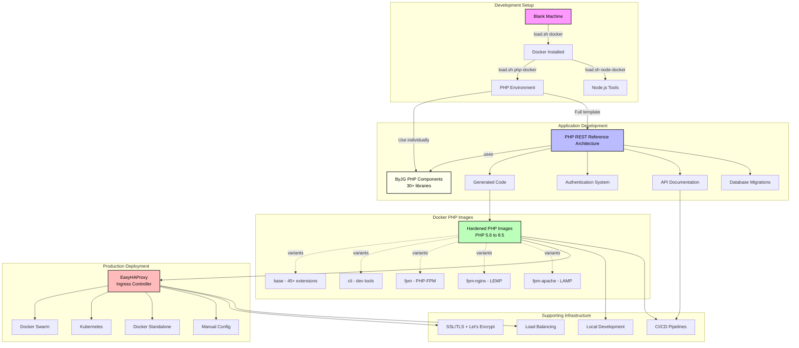

# Building a Complete PHP Application: From Zero to Production

Have you ever wondered how to go from a completely blank machine to a fully functional, production-ready PHP application? In this article, I'll walk you through the entire ByJG PHP ecosystem - a comprehensive set of tools and components that work together seamlessly to help you build modern PHP applications.

Whether you're working with Laravel, Symfony, or building from scratch, these components can help you accelerate development while maintaining production-grade quality.

<!-- truncate -->

## The Journey: From Blank Machine to Production

Let's start from the very beginning - a machine with nothing installed - and work our way up to a complete, production-ready API application.

### Step 1: Setting Up Your Development Environment

When you have a blank Linux machine (or WSL on Windows), the first challenge is getting Docker and PHP installed. This is where [shellscript.download](https://shellscript.download) comes in.

**First, install load.sh:**
```bash
/bin/bash -c "$(curl -fsSL https://shellscript.download/install/loader)"
```

**Installing Docker:**
```bash
load.sh docker
```

**Installing PHP 8.4 via Docker:**
```bash
load.sh php-docker -- 8.4
```

**Installing Node.js 22 (for modern development tools like Claude Code, Codex, etc.):**
```bash
load.sh node-docker -- 22
```

That's it! In just three commands, you now have:
- Docker installed and running
- PHP 8.4 ready to use via Docker containers
- Node.js 22 for modern development tools

The beauty of this approach is that everything runs in containers - no version conflicts, no dependency hell, just clean, reproducible environments.

## The PHP Components Ecosystem

Once your environment is ready, you gain access to an extensive collection of [production-tested PHP components](https://opensource.byjg.com/docs/php) that can be used with **ANY PHP framework** - Laravel, Symfony, or your own custom solution.

Here's what's available:

### Core Infrastructure Components

**[Cache Engine](https://opensource.byjg.com/docs/php/cache-engine)** - PSR-6 and PSR-16 compliant caching with multiple backends:
- File system, Redis, Memcached, Session
- Shared memory (ShmOp), TmpFS
- Built-in garbage collection and atomic operations

**[Config Management](https://opensource.byjg.com/docs/php/config)** - Environment-based configuration with dependency injection support

**[Migration](https://opensource.byjg.com/docs/php/migration)** - Database version control with up/down migrations supporting MySQL, PostgreSQL, SQLite, Oracle, and SQL Server

### Data Access & ORM

**[Micro-ORM](https://opensource.byjg.com/docs/php/micro-orm)** - Lightweight Object-Relational Mapping with:
- Query builder
- Active Record pattern support
- Repository pattern support
- Relationship mapping without heavy overhead

**[AnyDataset-DB](https://opensource.byjg.com/docs/php/anydataset-db)** - Universal database abstraction layer supporting multiple databases with a consistent API

### REST API & Web Services

**[RestServer](https://opensource.byjg.com/docs/php/restserver)** - Create RESTful services with:
- Auto-generation from OpenAPI/Swagger definitions
- Multiple output handlers (JSON, XML, HTML)
- Built-in middleware support (CORS, JWT, Static Server)
- Route caching for performance

**[Swagger Test](https://opensource.byjg.com/docs/php/swagger-test)** - Contract testing to ensure your API matches your OpenAPI specification

### Security & Authentication

**[AuthUser](https://opensource.byjg.com/docs/php/authuser)** - Complete user authentication and authorization system with:
- Session management
- Custom properties
- Multiple storage backends (Database, XML)

**[JWT Wrapper](https://opensource.byjg.com/docs/php/jwt-wrapper)** - JSON Web Token handling for stateless authentication

**[JWT Session](https://opensource.byjg.com/docs/php/jwt-session)** - JWT-based session management

**[Crypto](https://opensource.byjg.com/docs/php/crypto)** - Passwordless symmetric encryption with dynamic key generation

### Communication

**[MailWrapper](https://opensource.byjg.com/docs/php/mailwrapper)** - Send emails through multiple providers:
- SMTP (SSL/TLS)
- Amazon SES API
- Mailgun API
- Sendmail

**[Message Queue Client](https://opensource.byjg.com/docs/php/message-queue-client)** - Unified interface for message queuing:
- RabbitMQ support via [rabbitmq-client](https://github.com/byjg/rabbitmq-client)
- Redis Queue support via [redis-queue-client](https://github.com/byjg/redis-queue-client)
- Easy to implement custom connectors

**[SMS Client](https://opensource.byjg.com/docs/php/sms-client)** - Send SMS through various providers

### Utilities

**[ShortId](https://opensource.byjg.com/docs/php/shortid)** - Generate short, unique, URL-safe IDs

**[ImageUtil](https://opensource.byjg.com/docs/php/imageutil)** - Image manipulation and processing

**[Convert](https://opensource.byjg.com/docs/php/convert)** - Data conversion utilities

**[URI](https://opensource.byjg.com/docs/php/uri)** - URI manipulation and parsing

And [many more components](https://opensource.byjg.com/docs/php) covering various needs...

### Key Advantages

- **Framework Agnostic**: Use any component independently in your existing projects
- **PSR Compliant**: Follows PHP-FIG standards (PSR-6, PSR-7, PSR-11, PSR-16)
- **Well Documented**: Every component has comprehensive documentation with examples
- **Production Tested**: Used in real-world production environments
- **Composer Ready**: Simple installation via `composer require byjg/component-name`

## Building a Complete Application from Scratch

While you can use individual components with any framework, what if you want to create a complete API application from scratch? This is where the **[PHP REST Reference Architecture](https://github.com/byjg/php-rest-reference-architecture)** comes in.

### What is the PHP REST Reference Architecture?

The PHP REST Reference Architecture is a **production-ready template** (not a framework) that brings together the best components from the ByJG ecosystem into a cohesive, ready-to-use application structure.

### What's Included

**Code Generation & Architecture:**
- Automatic CRUD generation from database tables
- Choice between Repository Pattern (clean separation) or ActiveRecord Pattern (rapid prototyping)
- Auto-generated models, repositories, services, controllers, and tests

**Security Built-In:**
- JWT-based authentication system
- Role-Based Access Control (RBAC)
- Ready-to-use login endpoints

**API Documentation:**
- Auto-generated OpenAPI documentation synchronized with code
- Interactive Swagger UI for API exploration
- Contract testing to keep docs in sync

**Database Management:**
- Built-in migration system
- MicroORM for lightweight data access
- Query builder and relationship mapping

**Development Experience:**
- Docker containerization (MySQL, PHP-FPM, Nginx)
- Scriptify: interactive PHP terminal and CLI runner
- Comprehensive functional test suite
- Hot reload during development

**Production Ready:**
- Pre-configured CI/CD workflows (GitHub Actions, GitLab CI, Bitbucket Pipelines)
- Environment-based configuration
- Structured logging
- Error handling and reporting
- PSR-7, PSR-11, PSR-6/16 standards compliance

### Getting Started with Reference Architecture

```bash
# Install the template
load.sh php-rest-api -- my-api \
  --namespace=MyCompany \
  --name=mycompany/my-api \
  --install-examples=y
```

This single command creates a complete API application with:
- Project structure following clean architecture
- Database migrations ready
- Authentication system configured
- OpenAPI documentation generated
- Docker environment set up
- CI/CD pipelines ready
- Tests configured

You can start developing immediately with:
```bash
cd my-api
docker-compose up -d
composer codegen -- --env=dev --table=users all --save
```

## Production Deployment

### Hardened PHP Docker Images

For production deployment, the ecosystem provides [curated, security-hardened PHP Docker images](https://opensource.byjg.com/docs/devops/docker-php) supporting:

- **PHP Versions**: From 5.6 to 8.5 (edge)
- **Multi-Architecture**: AMD64 and ARM64 (Raspberry Pi, AWS Graviton)
- **Image Variants**:
  - `base` - Minimal with 45+ PHP extensions (~135MB)
  - `cli` - Development tools included (~154MB)
  - `fpm` - PHP-FPM for custom setups (~139MB)
  - `fpm-nginx` - Complete LEMP stack (~154MB)
  - `fpm-apache` - Complete LAMP stack (~154MB)

**Security Features:**
- Runs as non-root user (`app`)
- Includes SBOM & build provenance
- Monthly tagged releases for stability
- Regular security updates

**Example:**
```bash
docker pull byjg/php:8.4-fpm-nginx-2025.11
```

### Load Balancing & Ingress

For production traffic management, [EasyHAProxy](https://opensource.byjg.com/docs/devops/docker-easy-haproxy) provides dynamic HAProxy configuration through service discovery:

**Supported Platforms:**
- Docker standalone
- Docker Swarm clusters
- Kubernetes
- Manual static configuration

**Features:**
- Automatic SSL/TLS with Let's Encrypt (ACME protocol)
- Custom SSL certificates
- Load balancing across replicas
- Zero-downtime configuration reloads
- TCP mode support
- Built-in statistics dashboard

**Example for Docker Swarm:**
```bash
docker service create \
  --name my-api \
  --label easyhaproxy.host=api.example.com \
  --label easyhaproxy.ssl.type=letsencrypt \
  mycompany/my-api:latest
```

EasyHAProxy automatically detects the service, configures HAProxy, obtains SSL certificates, and starts routing traffic - no manual configuration needed!

## The Complete Ecosystem Flow

Here's how everything fits together:



## Real-World Workflow

Let's walk through a complete real-world scenario:

### Day 1: Project Setup
```bash
# Set up environment (one time)
/bin/bash -c "$(curl -fsSL https://shellscript.download/install/loader)"
load.sh docker
load.sh php-docker -- 8.4

# Create new project
load.sh php-rest-api -- my-shop-api \
  --namespace=MyShop \
  --name=mycompany/shop-api

cd my-shop-api
docker-compose up -d
```

### Day 2-10: Development
```bash
# Generate complete CRUD for products table
composer codegen -- --env=dev --table=products all --save

# Add email notifications using MailWrapper
composer require byjg/mailwrapper

# Add queue processing for async tasks
composer require byjg/redis-queue-client

# Run tests
composer test
```

### Week 2: CI/CD Setup
- Push to GitHub
- CI/CD workflows already configured (GitHub Actions)
- Automatic testing on every PR
- Docker image build on merge to main

### Month 1: Production Deployment
```bash
# Pull production-ready image
docker pull byjg/php:8.4-fpm-nginx-2025.11

# Build your application image using it as base
docker build -t mycompany/shop-api:1.0.0 .

# Deploy to Docker Swarm with EasyHAProxy
docker service create \
  --name shop-api \
  --replicas 3 \
  --label easyhaproxy.host=api.shop.com \
  --label easyhaproxy.ssl.type=letsencrypt \
  --label easyhaproxy.port=8080 \
  mycompany/shop-api:1.0.0
```

Your API is now:
- Running with 3 replicas for high availability
- Load balanced automatically
- Secured with Let's Encrypt SSL
- Monitored via HAProxy stats
- Ready to scale

## Why This Ecosystem?

### 1. **Consistency Across Environments**
The same Docker images run in development, CI/CD, and production - eliminating "works on my machine" issues.

### 2. **Rapid Development**
Go from idea to working API in minutes, not days. Code generation handles boilerplate while you focus on business logic.

### 3. **Production-Grade Quality**
Built-in authentication, authorization, logging, error handling, and testing mean you start with best practices, not technical debt.

### 4. **Framework Freedom**
Use components individually in existing projects or adopt the full reference architecture for new projects.

### 5. **Modern DevOps Practices**
CI/CD ready, containerized, with infrastructure as code. Deploy to any container orchestration platform.

### 6. **No Vendor Lock-In**
It's a template, not a framework. You own the code. Modify anything you need.

### 7. **Comprehensive Documentation**
Every component is documented with examples at [opensource.byjg.com](https://opensource.byjg.com)

## Ecosystem Components Summary

| Component | Purpose | Key Features |
|-----------|---------|--------------|
| [shellscript.download](https://shellscript.download) | Environment Setup | One-command Docker, PHP, Node installation |
| [ByJG Components](https://opensource.byjg.com/docs/php) | Reusable Libraries | 30+ production-tested PHP components |
| [PHP REST Reference Architecture](https://github.com/byjg/php-rest-reference-architecture) | Application Template | Complete API scaffold with auth, docs, CI/CD |
| [PHP Docker Images](https://opensource.byjg.com/docs/devops/docker-php) | Container Runtime | Hardened, multi-arch images PHP 5.6-8.5 |
| [EasyHAProxy](https://opensource.byjg.com/docs/devops/docker-easy-haproxy) | Ingress Controller | Auto-configured load balancing & SSL |

## Getting Started

Ready to build your next PHP application with this ecosystem? Here's how to start:

1. **For Existing Projects**: Browse the [component library](https://opensource.byjg.com/docs/php) and add individual components via Composer

2. **For New APIs**: Use the [PHP REST Reference Architecture](https://github.com/byjg/php-rest-reference-architecture) template

3. **For Environment Setup**: Visit [shellscript.download](https://shellscript.download) for installation scripts

4. **For Production**: Check out [PHP Docker Images](https://opensource.byjg.com/docs/devops/docker-php) and [EasyHAProxy](https://opensource.byjg.com/docs/devops/docker-easy-haproxy)

## Conclusion

The ByJG PHP ecosystem provides a complete, cohesive solution for modern PHP development - from your first command on a blank machine to a production-ready, scalable API application.

By combining:
- Simple environment setup
- Modular, reusable components
- Production-ready templates
- Hardened Docker images
- Automated load balancing

You can focus on building features instead of infrastructure, while maintaining professional-grade quality throughout the entire development lifecycle.

Whether you're building a small microservice or a complex application, this ecosystem has the tools you need to succeed.

---

**Explore the ecosystem:**
- Documentation: [https://opensource.byjg.com](https://opensource.byjg.com)
- GitHub: [https://github.com/byjg](https://github.com/byjg)
- Setup Scripts: [https://shellscript.download](https://shellscript.download)

Happy coding!
