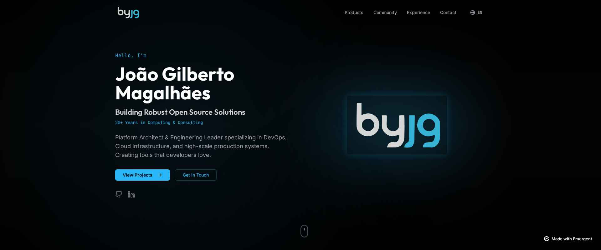
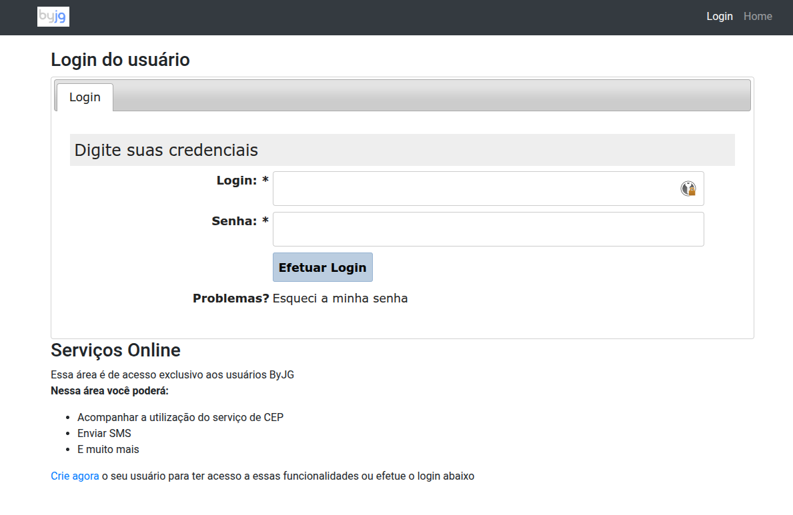
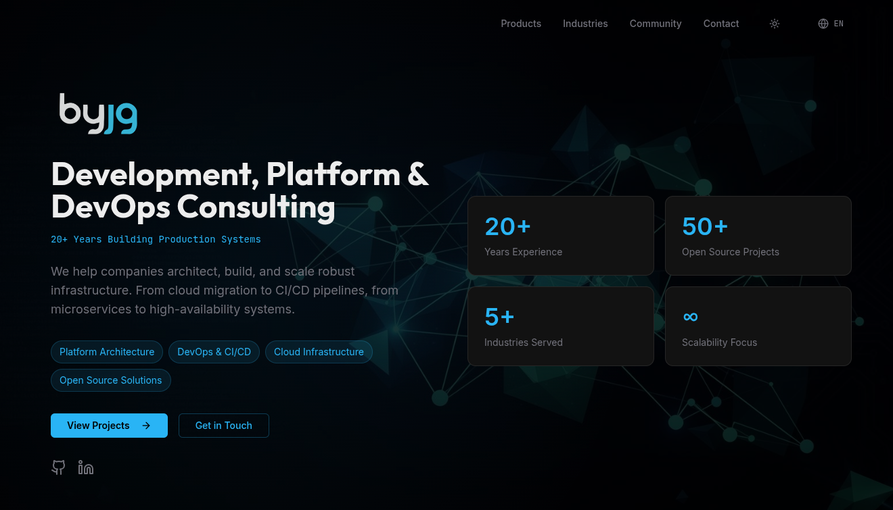

# Beyond Vibe Coding — AI as a Real Pair Programmer

I'm writing this article to explain my journey with what people call Vibe Coding. That's a terrible term, by the way. It always makes me think of doing something by "feel," just following the crowd — as if you're not really in control. In my work, I try to be pragmatic, and "coding by vibes" doesn't sound like something that produces lasting results. But before you jump to conclusions, let me explain a few things first.

<!-- truncate -->

## AI Productivity: What Actually Works

Some time ago I decided to adopt AI coding assistants, and the productivity gain is absurd. I managed to document my libraries and projects in days, not months. I fixed bugs and resolved issues much faster. I even built a prompt automator: I have 50 projects, they all need documentation, and they all share the same prompt — so I wrote a script that goes into each project, documents it, checks that I'm following the right patterns, runs the tests, runs the linter, and fixes what needs fixing. Wonderful.

But I'm also very critical. I noticed that when I ask the AI to create a document without any initial draft, the result almost always has short sentences, lots of paragraphs, and several clichés like "The problem isn't... it's about...", "It's not that, it's this" — filler comments that leave the content hollow. Even though it bothers me, for technical documentation the HOW matters more than word count, so I let it go. The best workflow I found is: I write a rough draft and use the AI as my reviewer. It catches spelling and grammar errors, rewrites passages where I know what I mean but haven't said it clearly, and then I can give opinions, challenge suggestions, and improve.

## Pair Programming with AI, Not Full Delegation

Here's the first important point: I don't delegate 100% to the AI. I wish I could. But there's always a point where it loses the thread. It repeats code. When a test fails, it writes `assertTrue(true)` and happily announces you now have 1,000 passing tests. It keeps spawning cute little monsters, Gremlins-style. By the time you notice, it's consuming resources and burning through everything you have.

That's why my first rule with AI is: Pair Programming. I define the task — usually with a specification — throw it into Claude Code and ask for a plan. From there, I refine that plan until it gives me something I can work with. Once I approve, I watch exactly what's being coded, stop it, step in, ask why it did something a certain way, ask it to look at the spec, point it to the right documentation.

I can't sit back and "relax," but it's much faster, and I end up 90% happy with the result. To explain this outside of tech: if I hand a car to someone who just wants to drive, it doesn't matter what I give them, as long as they can drive. But I don't just want to drive — I want to tune the car, upgrade it, integrate systems. That's where being side by side helps a lot.

Of course, there are situations where how it was built doesn't matter much. I built some sites on Lovable (I'll get there) entirely through it — and that's it. I don't need anything else. But professionally, I want a product I can maintain, that I understand at the end, that I can evolve, that scales, and that I can rely on. At that point, I'm out of the Vibe. Real business isn't about shipping more for the sake of it — it's about shipping more with quality, where the result is solid and I am the OWNER of the process, not the AI.

## The Real Project: Modernizing ByJG.com.br

So I decided to test in practice a scenario where AI isn't just my pair programmer. I have the site ByJG.com.br, where I host my portfolio and some services — only the CEP WebService is still active today. It was written around 2010, originally deployed via `git pull`, and now runs on Kubernetes with CI/CD — but the code is the same as 2010. It used my old XMLNuke framework, which I retired in 2016, but whose code served as the foundation for my PHP Reference Architecture for REST projects.

My goals were:
- Migrate from PHP 5.6 to 8.5
- MySQL 5.6 to 9.0
- Modernize the layout using something like Vite or Next
- Switch authentication to JWT
- Keep the old APIs working, since I still have users who depend on the service

Sounds simple, but if I were hiring a team I'd need:
- A backend developer able to work with both the legacy and the new code
- A frontend developer who understands design, to build the site and wire up the APIs
- A technical writer to help review the copy

So I acted as a Hands-On Technical Product Manager and hired this team:
- **Claude Code Max** as my Backend (and FullStack)
- **Lovable Pro** as my Frontend
- **Emergent.sh** as my alternative Frontend
- **ChatGPT Pro** as Solutions Architect, Reviewer, and Image Editor

I paid for all of these services.

## Lovable vs Emergent.sh: The Frontend Showdown

Both Lovable and Emergent.sh handle design and implement the website. I gave them the same prompt. Emergent.sh performed better in the creation phase: it asked clarifying questions about things that weren't well defined, which I really appreciated. That helped me sharpen the prompt to be clearer and more specific, and I started a new project in both. The first version from Emergent, in every attempt, was excellent.

**Emergent.sh**

**Lovable**

Points I evaluated in each:

| Feature                         | Emergent.sh            | Lovable             |
|---------------------------------|------------------------|---------------------|
| Design                          | Excellent              | Good                |
| Generated Code                  | Poor (Craco)           | Excellent (Vite)    |
| Git Integration                 | Good                   | Very Good           |
| Code Editing                    | Excellent (uses Coder) | Good (proprietary)  |
| Project Continuity              | Poor                   | Good                |
| Deploy (front-end only tested)  | Poor                   | Good                |

The code generated by Emergent looks like it came from an old-school template: there's a `backend` folder, a `frontend` folder, and the whole thing requires that exact structure to work. The backend uses Python and the frontend uses Craco — an abandoned framework with several outdated dependencies and known vulnerabilities. When Emergent saved the code to git (to its credit, I could push to any repository and branch), the `yarn.lock` wasn't included. When I tried running `yarn install`, nothing installed because of the broken dependencies.

That's when I called in my backend Claude, and realized he was also Full-Stack. He recommended migrating to Vite, explained why, and executed the migration quickly. With Lovable, I couldn't specify WHICH git repository to use, but it keeps the project in sync whether I modify things outside of it or inside Lovable — and it handles any framework well, which makes for good project continuity. Deploying the front-end on Emergent.sh costs 50 credits; on Lovable it's free.

**My verdict**: I still need to find a designer who works with Figma. And Lovable implements well. With the frontend MVP roughly in shape, I hand the integrations and heavier code to my FullStack, Claude, then go back to Lovable to publish. For the ByJG project specifically, I'll be publishing to Cloudflare — but that's another story.

## Migrating the Legacy Code

The second part was the conversion from legacy to new code. Before handing the mission to Claude, I had to set up the minimal infrastructure: I installed the Reference project with some classes and tests, got the environment running, and defined instructions for how to test and how the architecture was organized. With both environments running, I started giving Claude its instructions.

The initial instruction always goes in Planning mode. Instead of asking for a full conversion, I identified the common blocks and worked through them one at a time. First I asked it to build Login, Registration, and "Forgot my password." That was critical because it would define everything else. Once the API was implemented, I asked Claude to generate a Login Implementation Guide covering the flows and how to handle JWT. I used that guide to implement the frontend screens. It worked smoothly.

One important detail: each task was a separate Claude session. That forces it to search through the code from scratch, which, at least in my experience, produces better results. After that, I repeated the process for the other modules of the site.

Often, when it suggests a change I don't understand or don't think is efficient, I reject it and start like this: "Question: why did you use this instead of that?" or "Did you look at the documentation in folder X or in code ABC?" That's a way to push it to dig deeper into the codebase and suggest better solutions. There are situations where I Googled the topic to have a more technical discussion, especially when I wasn't sure. And many times I'd offer a solution but leave it open for the AI to suggest alternatives.

## The Frustrating Situations

There are some genuinely frustrating situations: 99% of the time it knows how to start the application and run tests, but in 1% of cases it gets lost and ends up in a loop trying to solve the problem the wrong way. When that happens, I stop it, close the session, and start a new one saying: "Investigate why this isn't working" or "The code at line X has an error; the expected behavior is A, B, C."

Sometimes it simply doesn't know what to do, claims to have finished a task when it actually hasn't (good thing it's not on payroll), and hacks something together to make the tests pass. In short — you have to keep watch.

## Conclusion

Either way, I'm very happy with the results. And I don't call this Vibe Coding — that would be unfair. It makes it sound like less than it is.

In the end, I took a site that was completely behind the times and turned it into this:

### Before

  

### After

  