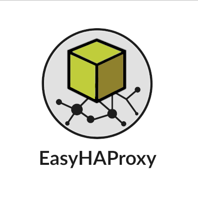
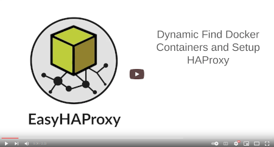
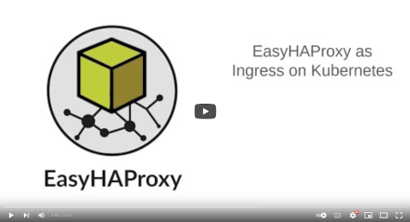
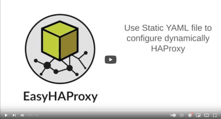
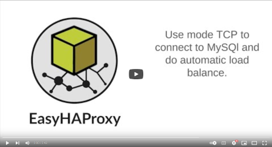

# EasyHAProxy

## Service discovery for HAProxy

EasyHAProxy dynamically creates `haproxy.cfg` based on metadata from your workloads — Docker labels, Swarm service labels, or Kubernetes Ingress annotations. No HAProxy knowledge required.

## Features

- **Automatic service discovery** — Docker, Docker Swarm, Kubernetes, or static YAML
- **Zero-downtime HAProxy reload** — configuration updates happen without dropping connections
- **Automatic TLS with ACME** — Let's Encrypt, ZeroSSL, BuyPass, and more
- **Custom SSL certificates** — volume-mount or label-embed your own PEM files
- **TCP mode** — proxy any TCP service, not just HTTP
- **Plugin system** — JWT validation, IP whitelisting, Cloudflare IP restoration, FastCGI, path blocking, and custom plugins
- **HAProxy stats dashboard** — optional, password-protected
- **Balance algorithms** — roundrobin, leastconn, source, uri, and more

## Supported platforms

Install using tools:

## Documentation

| Section | Description |
|---------|-------------|
| **[Getting Started](getting-started/)** | Choose your runtime and discovery mode, minimal working setup |
| **[Guides](guides/ssl)** | SSL, ACME, plugins, Helm, MicroK8s, Dokku, DigitalOcean |
| **[Concepts](concepts/)** | Service discovery, config pipeline, plugin model, TLS termination |
| **[Reference](reference/environment-variables)** | Environment variables, container labels, CLI flags, volumes |

## Who is using?

EasyHAProxy is part of some projects:
- [Dokku](guides/dokku)
- [MicroK8s](guides/microk8s)
- [DigitalOcean Marketplace](guides/digitalocean)

## See EasyHAProxy in action

Click on the image to see the videos (use HD for better visualization)

[Here is the code](https://gist.github.com/byjg/e125e478a0562190176d69ea795fd3d4) applied in the test examples above.

----
[Open source ByJG](http://opensource.byjg.com)
