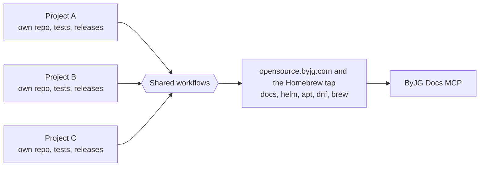

# The ByJG Ecosystem

The ByJG projects form one path. You build an application, test it on your
machine, deploy it and run it in production, and the container you tested is
the container that runs. Every project follows the same standard, and its
documentation is written for people and served to AI assistants.

## Independent projects, brought together by automation

Each project has its own repository, tests and release cycle, and works on its
own. You can use EasyHAProxy without any PHP component, or MicroOrm without any
ByJG Docker image.

What makes them one ecosystem is automation. When a project is merged or
tagged, shared workflows publish its documentation, its Helm chart and its
`apt` and `dnf` packages to this site. The
[Homebrew tap](https://github.com/byjg/homebrew-tap) works the other way: it
checks every day for new release tags and updates its formulas by itself.
Nothing is copied by hand and no project depends on another to release.

## 1. Build the application

[Gluo](../php/gluo/README.md) creates a REST API project you own, with
authentication, migrations, ORM, OpenAPI and a test harness already wired.
It is assembled from independent components that you can also use one by one:

| Need | Component |
|---|---|
| HTTP routing and OpenAPI | [RestServer](../php/restserver/README.md) |
| Persistence | [MicroOrm](../php/micro-orm/README.md), [AnyDataset DB](../php/anydataset-db/README.md), [Migration](../php/migration/README.md) |
| Serialization | [Serializer](../php/serializer/README.md) |
| Configuration and feature flags | [Config](../php/config/README.md), [Feature Flag](../php/featureflag/README.md) |
| Caching | [Cache Engine](../php/cache-engine/README.md) |
| Authentication | [AuthUser](../php/authuser/README.md), [JWT Wrapper](../php/jwt-wrapper/README.md) |
| Queues and workflows | [Message Queue Client](../php/message-queue-client/README.md), [State Machine](../php/statemachine/README.md) |
| Browser | [Yaj](../js/yaj/README.md), [Yaj SSE](../js/yaj-sse/README.md) |

The full list and the dependency graph are on the
[PHP components page](/docs/php).

## 2. Test it locally

The project comes with a `docker-compose.yml`, so `docker compose up -d`
starts the API, the database and the frontend on your machine. The containers
are built from the [ByJG PHP images](../devops/docker-php/README.md), which
exist in CLI, FPM, Nginx and Apache variants for each PHP version. Nothing has
to be installed on the host besides Docker.

API tests check the responses against the OpenAPI contract with
[Swagger Test](../php/swagger-test/README.md).

## 3. Deploy it

The same pipeline that runs the tests builds the application image.
[k8s-ci](../devops/k8s-ci.md) is the CI image with the tools to build and
deploy, and [Helm charts](/docs/helm) are published for the projects that run
on Kubernetes.

[DockNimbus](../devops/nimbus/README.md) provides the place to deploy to. It
turns bare metal machines and VMs into a platform with compute, networking,
storage, Docker Swarm and K3s clusters, declared in a
[single manifest](../devops/nimbus/guides/manifest/overview.md).

## 4. Run it in production

Production runs the image that was tested locally and in CI, so there is no
difference between environments to debug.

[EasyHAProxy](../devops/docker-easy-haproxy/README.md) is the load balancer in
front. It discovers the services from Docker labels, Swarm services or
Kubernetes Ingress, issues the TLS certificates and reloads HAProxy without
dropping connections. DockNimbus
[uses it for load balancing](../devops/nimbus/guides/swarms-and-load-balancing.md).
[Static HTTP Server](../devops/docker-static-httpserver/README.md) serves frontends
and static sites.

## 5. One standard for every project

All projects are tested, released and documented the same way. The
[Development Guidelines](guidelines/README.md) define it:

- Nothing is published before the tests pass.
- Releases are tags, with semantic versions.
- CI is written once as reusable workflows and called from each project.
- Documentation lives in the project repository, next to the code.

Publishing is automated too. A project does not build its own release
machinery; it calls a shared workflow or pushes a tag:

| What is published | How | How you get it |
|---|---|---|
| Documentation | [`add-doc.yaml`](guidelines/add-docs.md) reusable workflow | This site, and the Docs MCP index |
| Helm charts | [`add-helm.yaml`](guidelines/helm.md) reusable workflow | `helm repo add byjg https://opensource.byjg.com/helm` |
| DEB packages | [`add-pkg.yaml`](guidelines/linux-packages.md) reusable workflow, signed | `apt install` from the [APT repository](/docs/packages) |
| RPM packages | [`add-pkg.yaml`](guidelines/linux-packages.md) reusable workflow, signed | `dnf install` from the [RPM repository](/docs/packages) |
| Homebrew formulas | A [daily workflow in the tap](guidelines/linux-packages.md#homebrew) picks up new release tags, then builds, tests and audits the formula | `brew install byjg/tap/<formula>` |
| Docker images | The project's [`build.yml`](guidelines/docker-images.md) | `docker pull byjg/<image>` |
| PHP components | [A git tag](guidelines/php-components.md) | `composer require byjg/<component>` |

The reasons are in the [KISS principle](kiss.md) and in
[Simple Principles to Avoid Overcomplicating the Complex](/blog/simple-principles-avoid-complexity).

## 6. Documentation for humans and AI assistants

When a project is merged, a [reusable workflow](guidelines/add-docs.md) copies
its documentation to this site. The
[ByJG Docs MCP server](../ai/mcpserver-byjg-docs/README.md) indexes the site
with semantic and keyword search, and any assistant that speaks
[MCP](https://modelcontextprotocol.io) can query it and cite the page.

An agent asked to add persistence to a ByJG application then finds
[MicroOrm](../php/micro-orm/README.md) and how it is meant to be used, instead
of inventing a data layer. [Parolsh](../ai/parolsh/README.md) is the shell to
work with that agent: natural language by default, Bash one `!` away, and any
[ACP](https://agentclientprotocol.com) agent behind it.

## The method

The path above is the result of a method that can be repeated in any set of
projects, with or without the ByJG tools:

1. **Automate what is repetitive.** Tests, builds, releases, Helm charts,
   Linux packages and documentation publishing run in CI.
2. **Centralize what is shared.** One set of workflows, one documentation
   site, one set of base images.
3. **Isolate what is independent.** Each component has its own repository,
   tests and release cycle. Automation, and only automation, is what joins
   them.
4. **Use the same container everywhere.** Development, CI and production run
   the same image.
5. **Write the documentation once, for two readers.** A person reads it on the
   site; an AI assistant reads it through MCP.

[How I Manage 30+ Open Source Projects](/blog/2025/11/09/how-i-manage-30-open-source-projects)
tells how this method came to be.
