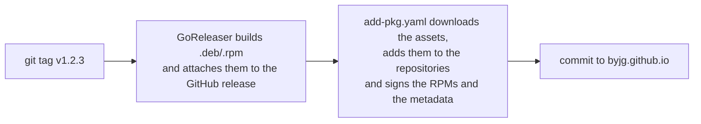

# Publishing Linux packages

ByJG hosts an APT repository at `https://opensource.byjg.com/apt` and an RPM
repository at `https://opensource.byjg.com/rpm`. Their metadata and the RPM
packages are signed with the ByJG Opensource key, published as
`https://opensource.byjg.com/byjg.gpg` (binary, for APT) and
`https://opensource.byjg.com/byjg.asc` (armored, for RPM). Both repositories
are stored in `packages/` of this site's repository.

How users install from them: [Linux Package Repository](/docs/packages).

## How it works



The [`add-pkg.yaml`](https://github.com/byjg/byjg.github.io/blob/master/.github/workflows/add-pkg.yaml)
workflow does not build anything. It picks up the `*.deb` and `*.rpm` files
attached to a GitHub release, so the project must build and attach them first.

## Build the packages

Use [GoReleaser](https://goreleaser.com) with an `nfpms` section. Trimmed
from `docker-static-httpserver/.goreleaser.yaml`:

```yaml
builds:
  - id: static-httpserver
    binary: static-httpserver
    env:
      - CGO_ENABLED=0
    goos:
      - linux
      - darwin        # archives only; packages are built for linux
    goarch:
      - amd64
      - arm64

nfpms:
  - id: static-httpserver-pkg
    package_name: static-httpserver
    ids:
      - static-httpserver
    vendor: ByJG
    homepage: https://github.com/byjg/docker-static-httpserver
    maintainer: ByJG <opensource@byjg.com>
    description: Minimal HTTP/HTTPS server for static files with SPA support
    license: MIT
    formats:
      - deb
      - rpm
```

- Build **amd64 and arm64**; the APT repository declares both.
- `package_name` is what users type in `apt install`. All ByJG packages share
  one repository, so it must be unique across projects.

## Add the release workflow

`.github/workflows/release.yaml`:

```yaml
name: Release

on:
  push:
    tags:
      - "v*"

permissions:
  contents: write

jobs:
  release:
    runs-on: ubuntu-latest
    steps:
      - uses: actions/checkout@v4
        with:
          fetch-depth: 0

      - uses: actions/setup-go@v5
        with:
          go-version-file: go.mod

      - name: Run GoReleaser
        uses: goreleaser/goreleaser-action@v6
        with:
          version: latest
          args: release --clean
        env:
          GITHUB_TOKEN: ${{ secrets.GITHUB_TOKEN }}

  publish-packages:
    needs: release
    uses: byjg/byjg.github.io/.github/workflows/add-pkg.yaml@master
    with:
      org: byjg
      repo: docker-static-httpserver
      tag: ${{ github.ref_name }}
    secrets:
      DOC_TOKEN: ${{ secrets.DOC_TOKEN }}
      GPG_PRIVATE_KEY: ${{ secrets.GPG_PRIVATE_KEY }}
```

| Input | Meaning |
|---|---|
| `org` | Repository owner; defaults to `byjg` |
| `repo` | Repository whose release holds the packages |
| `tag` | Release tag to download from |

`publish-packages` **must** `needs: release`: the assets have to exist before
they can be downloaded.

## What the workflow does

1. Imports `GPG_PRIVATE_KEY` and re-exports the public key to
   `packages/byjg.gpg` (binary) and `packages/byjg.asc` (armored).
2. Downloads the release's `*.deb` and `*.rpm` assets.
3. **APT:** copies the `.deb` files into `packages/apt/`, regenerates
   `Packages`, `Packages.gz` and `Release`, and signs them into `Release.gpg`
   and `InRelease`.
4. **RPM:** copies the `.rpm` files into `packages/rpm/`, signs every `.rpm`
   there with `rpmsign --addsign` (files already signed by the key are
   skipped), runs `createrepo_c --update`, and signs `repodata/repomd.xml`.
   The RPMs in the repository are signed; the ones attached to the GitHub
   release are not.
5. Commits `[skip ci] Add packages from <org>/<repo> <tag>` and pushes.

## Rules

- **Never republish a version.** Files with the same name are overwritten in
  place. A change means a new tag.
- **Check the log when nothing appears.** A release without matching assets
  is not an error: the job logs `No .deb files found, skipping APT` and
  succeeds.
- **Old versions stay.** The repository keeps every version
  (`dpkg-scanpackages --multiversion`), so users can pin one.

## The signing key

The repository metadata -- APT `Release`/`InRelease` and RPM
`repodata/repomd.xml` -- and every RPM package are signed with the ByJG
Opensource key. The RPM setup uses `gpgcheck=1` (package signature) and
`repo_gpgcheck=1` (metadata signature), so `dnf install` refuses an unsigned
RPM.

| | |
|---|---|
| User ID | `ByJG Opensource <info@byjg.com.br>` |
| Fingerprint | `DB84 6CC3 C109 29D3 43B6  B6DC 4BCC 9780 596C 4BCF` |

Check that the key you download matches:

```bash
curl -fsSL https://opensource.byjg.com/byjg.gpg | gpg --show-keys
```

The private key is held by the maintainers. It reaches a repository as the
`GPG_PRIVATE_KEY` secret, provisioned from a private infrastructure
repository -- never set by hand. A new repository that needs to publish
packages must be registered by a maintainer.

If the key is ever rotated, `byjg.gpg` and `byjg.asc` change and every user
must download them again, or `apt update` and `dnf` reject the repository. The
next workflow run re-signs every RPM in the repository with the new key.
