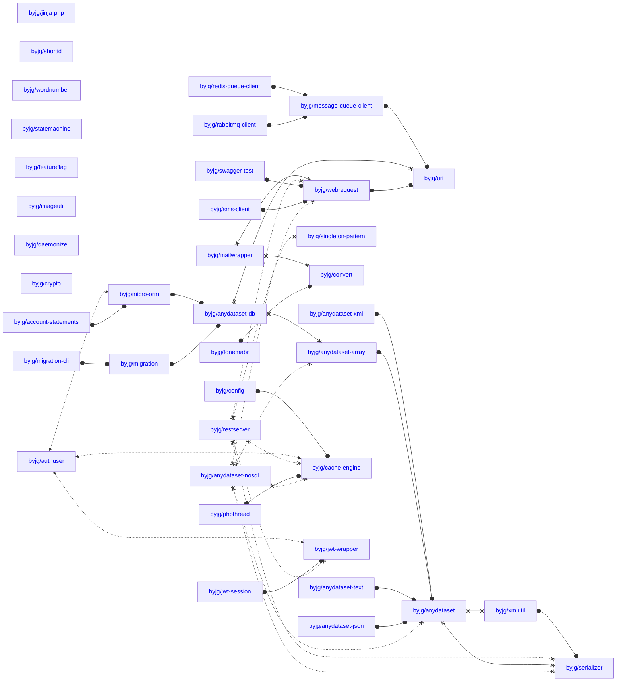

# PHP Components
## Class Dependency

```mermaid
graph LR;
  byjg/anydataset-nosql[<a href='https://opensource.byjg.com/docs/php/anydataset-nosql' style='text-decoration:none'>byjg/anydataset-nosql</a>];
  byjg/jinja-php[<a href='https://opensource.byjg.com/docs/php/jinja-php' style='text-decoration:none'>byjg/jinja-php</a>];
  byjg/anydataset-text[<a href='https://opensource.byjg.com/docs/php/anydataset-text' style='text-decoration:none'>byjg/anydataset-text</a>];
  byjg/shortid[<a href='https://opensource.byjg.com/docs/php/shortid' style='text-decoration:none'>byjg/shortid</a>];
  byjg/rabbitmq-client[<a href='https://opensource.byjg.com/docs/php/rabbitmq-client' style='text-decoration:none'>byjg/rabbitmq-client</a>];
  byjg/wordnumber[<a href='https://opensource.byjg.com/docs/php/wordnumber' style='text-decoration:none'>byjg/wordnumber</a>];
  byjg/statemachine[<a href='https://opensource.byjg.com/docs/php/statemachine' style='text-decoration:none'>byjg/statemachine</a>];
  byjg/anydataset-xml[<a href='https://opensource.byjg.com/docs/php/anydataset-xml' style='text-decoration:none'>byjg/anydataset-xml</a>];
  byjg/restserver[<a href='https://opensource.byjg.com/docs/php/restserver' style='text-decoration:none'>byjg/restserver</a>];
  byjg/anydataset-json[<a href='https://opensource.byjg.com/docs/php/anydataset-json' style='text-decoration:none'>byjg/anydataset-json</a>];
  byjg/fonemabr[<a href='https://opensource.byjg.com/docs/php/fonemabr' style='text-decoration:none'>byjg/fonemabr</a>];
  byjg/featureflag[<a href='https://opensource.byjg.com/docs/php/featureflag' style='text-decoration:none'>byjg/featureflag</a>];
  byjg/imageutil[<a href='https://opensource.byjg.com/docs/php/imageutil' style='text-decoration:none'>byjg/imageutil</a>];
  byjg/daemonize[<a href='https://opensource.byjg.com/docs/php/daemonize' style='text-decoration:none'>byjg/daemonize</a>];
  byjg/sms-client[<a href='https://opensource.byjg.com/docs/php/sms-client' style='text-decoration:none'>byjg/sms-client</a>];
  byjg/swagger-test[<a href='https://opensource.byjg.com/docs/php/swagger-test' style='text-decoration:none'>byjg/swagger-test</a>];
  byjg/mailwrapper[<a href='https://opensource.byjg.com/docs/php/mailwrapper' style='text-decoration:none'>byjg/mailwrapper</a>];
  byjg/crypto[<a href='https://opensource.byjg.com/docs/php/crypto' style='text-decoration:none'>byjg/crypto</a>];
  byjg/phpthread[<a href='https://opensource.byjg.com/docs/php/phpthread' style='text-decoration:none'>byjg/phpthread</a>];
  byjg/jwt-session[<a href='https://opensource.byjg.com/docs/php/jwt-session' style='text-decoration:none'>byjg/jwt-session</a>];
  byjg/account-statements[<a href='https://opensource.byjg.com/docs/php/account-statements' style='text-decoration:none'>byjg/account-statements</a>];
  byjg/redis-queue-client[<a href='https://opensource.byjg.com/docs/php/redis-queue-client' style='text-decoration:none'>byjg/redis-queue-client</a>];
  byjg/migration-cli[<a href='https://opensource.byjg.com/docs/php/migration-cli' style='text-decoration:none'>byjg/migration-cli</a>];
  byjg/config[<a href='https://opensource.byjg.com/docs/php/config' style='text-decoration:none'>byjg/config</a>];
  byjg/authuser[<a href='https://opensource.byjg.com/docs/php/authuser' style='text-decoration:none'>byjg/authuser</a>];
  byjg/singleton-pattern[<a href='https://opensource.byjg.com/docs/php/singleton-pattern' style='text-decoration:none'>byjg/singleton-pattern</a>];
  byjg/convert[<a href='https://opensource.byjg.com/docs/php/convert' style='text-decoration:none'>byjg/convert</a>];
  byjg/webrequest[<a href='https://opensource.byjg.com/docs/php/webrequest' style='text-decoration:none'>byjg/webrequest</a>];
  byjg/message-queue-client[<a href='https://opensource.byjg.com/docs/php/message-queue-client' style='text-decoration:none'>byjg/message-queue-client</a>];
  byjg/migration[<a href='https://opensource.byjg.com/docs/php/migration' style='text-decoration:none'>byjg/migration</a>];
  byjg/micro-orm[<a href='https://opensource.byjg.com/docs/php/micro-orm' style='text-decoration:none'>byjg/micro-orm</a>];
  byjg/cache-engine[<a href='https://opensource.byjg.com/docs/php/cache-engine' style='text-decoration:none'>byjg/cache-engine</a>];
  byjg/jwt-wrapper[<a href='https://opensource.byjg.com/docs/php/jwt-wrapper' style='text-decoration:none'>byjg/jwt-wrapper</a>];
  byjg/anydataset-db[<a href='https://opensource.byjg.com/docs/php/anydataset-db' style='text-decoration:none'>byjg/anydataset-db</a>];
  byjg/anydataset-array[<a href='https://opensource.byjg.com/docs/php/anydataset-array' style='text-decoration:none'>byjg/anydataset-array</a>];
  byjg/uri[<a href='https://opensource.byjg.com/docs/php/uri' style='text-decoration:none'>byjg/uri</a>];
  byjg/anydataset[<a href='https://opensource.byjg.com/docs/php/anydataset' style='text-decoration:none'>byjg/anydataset</a>];
  byjg/xmlutil[<a href='https://opensource.byjg.com/docs/php/xmlutil' style='text-decoration:none'>byjg/xmlutil</a>];
  byjg/serializer[<a href='https://opensource.byjg.com/docs/php/serializer' style='text-decoration:none'>byjg/serializer</a>];
  byjg/anydataset-xml o--o byjg/anydataset;
  byjg/config o--o byjg/cache-engine;
  byjg/authuser <-.-> byjg/micro-orm;
  byjg/authuser <-.-> byjg/cache-engine;
  byjg/authuser <-.-> byjg/jwt-wrapper;
  byjg/jwt-session o--o byjg/jwt-wrapper;
  byjg/redis-queue-client o--o byjg/message-queue-client;
  byjg/xmlutil o--o byjg/serializer;
  byjg/anydataset-array o--o byjg/anydataset;
  byjg/anydataset-text o--o byjg/anydataset;
  byjg/mailwrapper x--x byjg/convert;
  byjg/mailwrapper x--x byjg/webrequest;
  byjg/restserver x-.-x byjg/serializer;
  byjg/restserver x-.-x byjg/singleton-pattern;
  byjg/restserver x-.-x byjg/cache-engine;
  byjg/restserver x-.-x byjg/webrequest;
  byjg/restserver x-.-x byjg/jwt-wrapper;
  byjg/anydataset x--x byjg/serializer;
  byjg/anydataset x--x byjg/xmlutil;
  byjg/micro-orm o--o byjg/anydataset-db;
  byjg/phpthread o--o byjg/cache-engine;
  byjg/anydataset-json o--o byjg/anydataset;
  byjg/swagger-test o--o byjg/webrequest;
  byjg/fonemabr o--o byjg/convert;
  byjg/account-statements o--o byjg/micro-orm;
  byjg/sms-client o--o byjg/webrequest;
  byjg/migration-cli o--o byjg/migration;
  byjg/message-queue-client o--o byjg/uri;
  byjg/anydataset-db x--x byjg/anydataset-array;
  byjg/anydataset-db x--x byjg/uri;
  byjg/webrequest o--o byjg/uri;
  byjg/migration o--o byjg/anydataset-db;
  byjg/rabbitmq-client o--o byjg/message-queue-client;
  byjg/anydataset-nosql x-.-x byjg/anydataset;
  byjg/anydataset-nosql x-.-x byjg/anydataset-array;
  byjg/anydataset-nosql x-.-x byjg/serializer;
  byjg/anydataset-nosql x-.-x byjg/webrequest;
  byjg/anydataset-nosql x-.-x byjg/cache-engine;
```
