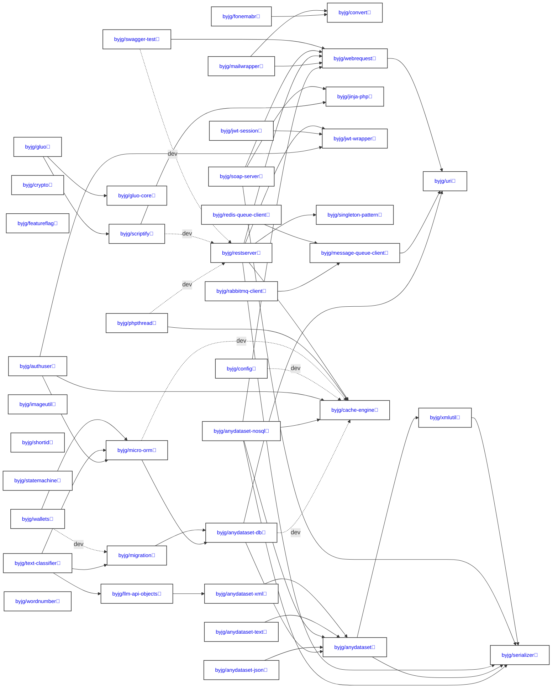

# PHP Components
## Class Dependency

Generated from each component's `composer.json`.
Solid is `require`, `dev` is `require-dev`, `suggest` is optional.

```mermaid
graph LR;
  byjg/anydataset-json[<a href='https://opensource.byjg.com/docs/php/anydataset-json' style='text-decoration:none'>byjg/anydataset-json🔗</a>];
  byjg/anydataset-nosql[<a href='https://opensource.byjg.com/docs/php/anydataset-nosql' style='text-decoration:none'>byjg/anydataset-nosql🔗</a>];
  byjg/anydataset-text[<a href='https://opensource.byjg.com/docs/php/anydataset-text' style='text-decoration:none'>byjg/anydataset-text🔗</a>];
  byjg/authuser[<a href='https://opensource.byjg.com/docs/php/authuser' style='text-decoration:none'>byjg/authuser🔗</a>];
  byjg/config[<a href='https://opensource.byjg.com/docs/php/config' style='text-decoration:none'>byjg/config🔗</a>];
  byjg/crypto[<a href='https://opensource.byjg.com/docs/php/crypto' style='text-decoration:none'>byjg/crypto🔗</a>];
  byjg/featureflag[<a href='https://opensource.byjg.com/docs/php/featureflag' style='text-decoration:none'>byjg/featureflag🔗</a>];
  byjg/fonemabr[<a href='https://opensource.byjg.com/docs/php/fonemabr' style='text-decoration:none'>byjg/fonemabr🔗</a>];
  byjg/gluo[<a href='https://opensource.byjg.com/docs/php/gluo' style='text-decoration:none'>byjg/gluo🔗</a>];
  byjg/imageutil[<a href='https://opensource.byjg.com/docs/php/imageutil' style='text-decoration:none'>byjg/imageutil🔗</a>];
  byjg/jwt-session[<a href='https://opensource.byjg.com/docs/php/jwt-session' style='text-decoration:none'>byjg/jwt-session🔗</a>];
  byjg/mailwrapper[<a href='https://opensource.byjg.com/docs/php/mailwrapper' style='text-decoration:none'>byjg/mailwrapper🔗</a>];
  byjg/phpthread[<a href='https://opensource.byjg.com/docs/php/phpthread' style='text-decoration:none'>byjg/phpthread🔗</a>];
  byjg/rabbitmq-client[<a href='https://opensource.byjg.com/docs/php/rabbitmq-client' style='text-decoration:none'>byjg/rabbitmq-client🔗</a>];
  byjg/redis-queue-client[<a href='https://opensource.byjg.com/docs/php/redis-queue-client' style='text-decoration:none'>byjg/redis-queue-client🔗</a>];
  byjg/shortid[<a href='https://opensource.byjg.com/docs/php/shortid' style='text-decoration:none'>byjg/shortid🔗</a>];
  byjg/soap-server[<a href='https://opensource.byjg.com/docs/php/soap-server' style='text-decoration:none'>byjg/soap-server🔗</a>];
  byjg/statemachine[<a href='https://opensource.byjg.com/docs/php/statemachine' style='text-decoration:none'>byjg/statemachine🔗</a>];
  byjg/swagger-test[<a href='https://opensource.byjg.com/docs/php/swagger-test' style='text-decoration:none'>byjg/swagger-test🔗</a>];
  byjg/text-classifier[<a href='https://opensource.byjg.com/docs/php/text-classifier' style='text-decoration:none'>byjg/text-classifier🔗</a>];
  byjg/wallets[<a href='https://opensource.byjg.com/docs/php/wallets' style='text-decoration:none'>byjg/wallets🔗</a>];
  byjg/wordnumber[<a href='https://opensource.byjg.com/docs/php/wordnumber' style='text-decoration:none'>byjg/wordnumber🔗</a>];
  byjg/gluo-core[<a href='https://opensource.byjg.com/docs/php/gluo-core' style='text-decoration:none'>byjg/gluo-core🔗</a>];
  byjg/scriptify[<a href='https://opensource.byjg.com/docs/php/scriptify' style='text-decoration:none'>byjg/scriptify🔗</a>];
  byjg/convert[<a href='https://opensource.byjg.com/docs/php/convert' style='text-decoration:none'>byjg/convert🔗</a>];
  byjg/message-queue-client[<a href='https://opensource.byjg.com/docs/php/message-queue-client' style='text-decoration:none'>byjg/message-queue-client🔗</a>];
  byjg/llm-api-objects[<a href='https://opensource.byjg.com/docs/php/llm-api-objects' style='text-decoration:none'>byjg/llm-api-objects🔗</a>];
  byjg/micro-orm[<a href='https://opensource.byjg.com/docs/php/micro-orm' style='text-decoration:none'>byjg/micro-orm🔗</a>];
  byjg/migration[<a href='https://opensource.byjg.com/docs/php/migration' style='text-decoration:none'>byjg/migration🔗</a>];
  byjg/jinja-php[<a href='https://opensource.byjg.com/docs/php/jinja-php' style='text-decoration:none'>byjg/jinja-php🔗</a>];
  byjg/restserver[<a href='https://opensource.byjg.com/docs/php/restserver' style='text-decoration:none'>byjg/restserver🔗</a>];
  byjg/anydataset-xml[<a href='https://opensource.byjg.com/docs/php/anydataset-xml' style='text-decoration:none'>byjg/anydataset-xml🔗</a>];
  byjg/anydataset-db[<a href='https://opensource.byjg.com/docs/php/anydataset-db' style='text-decoration:none'>byjg/anydataset-db🔗</a>];
  byjg/jwt-wrapper[<a href='https://opensource.byjg.com/docs/php/jwt-wrapper' style='text-decoration:none'>byjg/jwt-wrapper🔗</a>];
  byjg/singleton-pattern[<a href='https://opensource.byjg.com/docs/php/singleton-pattern' style='text-decoration:none'>byjg/singleton-pattern🔗</a>];
  byjg/webrequest[<a href='https://opensource.byjg.com/docs/php/webrequest' style='text-decoration:none'>byjg/webrequest🔗</a>];
  byjg/anydataset[<a href='https://opensource.byjg.com/docs/php/anydataset' style='text-decoration:none'>byjg/anydataset🔗</a>];
  byjg/cache-engine[<a href='https://opensource.byjg.com/docs/php/cache-engine' style='text-decoration:none'>byjg/cache-engine🔗</a>];
  byjg/uri[<a href='https://opensource.byjg.com/docs/php/uri' style='text-decoration:none'>byjg/uri🔗</a>];
  byjg/xmlutil[<a href='https://opensource.byjg.com/docs/php/xmlutil' style='text-decoration:none'>byjg/xmlutil🔗</a>];
  byjg/serializer[<a href='https://opensource.byjg.com/docs/php/serializer' style='text-decoration:none'>byjg/serializer🔗</a>];
  byjg/anydataset-db --> byjg/anydataset;
  byjg/anydataset-db --> byjg/uri;
  byjg/anydataset-db -.->|dev| byjg/cache-engine;
  byjg/anydataset-json --> byjg/anydataset;
  byjg/anydataset-nosql --> byjg/anydataset;
  byjg/anydataset-nosql --> byjg/cache-engine;
  byjg/anydataset-nosql --> byjg/serializer;
  byjg/anydataset-nosql --> byjg/webrequest;
  byjg/anydataset-text --> byjg/anydataset;
  byjg/anydataset-xml --> byjg/anydataset;
  byjg/anydataset --> byjg/serializer;
  byjg/anydataset --> byjg/xmlutil;
  byjg/authuser --> byjg/cache-engine;
  byjg/authuser --> byjg/jwt-wrapper;
  byjg/authuser --> byjg/micro-orm;
  byjg/config -.->|dev| byjg/cache-engine;
  byjg/fonemabr --> byjg/convert;
  byjg/gluo --> byjg/gluo-core;
  byjg/gluo --> byjg/scriptify;
  byjg/jwt-session --> byjg/jwt-wrapper;
  byjg/llm-api-objects --> byjg/anydataset-xml;
  byjg/mailwrapper --> byjg/convert;
  byjg/mailwrapper --> byjg/webrequest;
  byjg/message-queue-client --> byjg/uri;
  byjg/micro-orm --> byjg/anydataset-db;
  byjg/micro-orm -.->|dev| byjg/cache-engine;
  byjg/migration --> byjg/anydataset-db;
  byjg/phpthread --> byjg/cache-engine;
  byjg/phpthread -.->|dev| byjg/restserver;
  byjg/rabbitmq-client --> byjg/message-queue-client;
  byjg/redis-queue-client --> byjg/message-queue-client;
  byjg/restserver --> byjg/cache-engine;
  byjg/restserver --> byjg/jwt-wrapper;
  byjg/restserver --> byjg/serializer;
  byjg/restserver --> byjg/singleton-pattern;
  byjg/restserver --> byjg/webrequest;
  byjg/scriptify --> byjg/jinja-php;
  byjg/scriptify -.->|dev| byjg/restserver;
  byjg/soap-server --> byjg/jinja-php;
  byjg/soap-server --> byjg/serializer;
  byjg/soap-server --> byjg/webrequest;
  byjg/swagger-test --> byjg/webrequest;
  byjg/swagger-test -.->|dev| byjg/restserver;
  byjg/text-classifier --> byjg/llm-api-objects;
  byjg/text-classifier --> byjg/micro-orm;
  byjg/text-classifier --> byjg/migration;
  byjg/wallets --> byjg/micro-orm;
  byjg/wallets -.->|dev| byjg/migration;
  byjg/webrequest --> byjg/uri;
  byjg/xmlutil --> byjg/serializer;
  classDef default fill:#ffffff,stroke:#333,stroke-width:1.5px,color:#000,font-size:14px;
  classDef highlight fill:#ffef96,stroke:#ff9900,stroke-width:3px;
  classDef deprecated fill:#f8f8f8,stroke:#cccccc,stroke-dasharray: 5 5,stroke-width:1px,color:#999;
  classDef working-on fill:#fff3cd,stroke:#ffcc00,stroke-width:2px,color:#856404;
  classDef finished fill:#d4edda,stroke:#28a745,stroke-width:2px,color:#155724;
```
