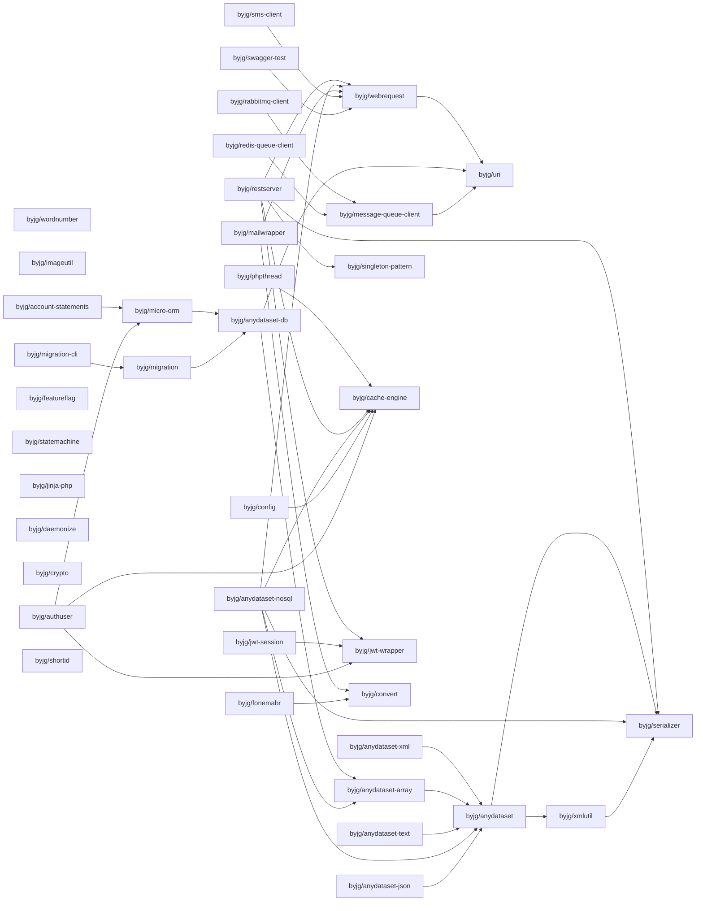

# PHP Components
## Class Dependency

```mermaid
graph LR;
  byjg/wordnumber;
  byjg/rabbitmq-client;
  byjg/sms-client;
  byjg/anydataset-xml;
  byjg/redis-queue-client;
  byjg/anydataset-json;
  byjg/imageutil;
  byjg/account-statements;
  byjg/fonemabr;
  byjg/migration-cli;
  byjg/anydataset-text;
  byjg/featureflag;
  byjg/statemachine;
  byjg/restserver;
  byjg/jwt-session;
  byjg/config;
  byjg/jinja-php;
  byjg/daemonize;
  byjg/phpthread;
  byjg/anydataset-nosql;
  byjg/crypto;
  byjg/authuser;
  byjg/shortid;
  byjg/mailwrapper;
  byjg/swagger-test;
  byjg/message-queue-client;
  byjg/migration;
  byjg/singleton-pattern;
  byjg/micro-orm;
  byjg/cache-engine;
  byjg/jwt-wrapper;
  byjg/convert;
  byjg/webrequest;
  byjg/anydataset-db;
  byjg/anydataset-array;
  byjg/uri;
  byjg/anydataset;
  byjg/xmlutil;
  byjg/serializer;
  byjg/migration --> byjg/anydataset-db;
  byjg/fonemabr --> byjg/convert;
  byjg/swagger-test --> byjg/webrequest;
  byjg/authuser --> byjg/micro-orm;
  byjg/authuser --> byjg/cache-engine;
  byjg/authuser --> byjg/jwt-wrapper;
  byjg/config --> byjg/cache-engine;
  byjg/message-queue-client --> byjg/uri;
  byjg/sms-client --> byjg/webrequest;
  byjg/xmlutil --> byjg/serializer;
  byjg/anydataset-json --> byjg/anydataset;
  byjg/mailwrapper --> byjg/convert;
  byjg/mailwrapper --> byjg/webrequest;
  byjg/anydataset-nosql --> byjg/anydataset;
  byjg/anydataset-nosql --> byjg/anydataset-array;
  byjg/anydataset-nosql --> byjg/serializer;
  byjg/anydataset-nosql --> byjg/webrequest;
  byjg/anydataset-nosql --> byjg/cache-engine;
  byjg/migration-cli --> byjg/migration;
  byjg/redis-queue-client --> byjg/message-queue-client;
  byjg/jwt-session --> byjg/jwt-wrapper;
  byjg/anydataset --> byjg/serializer;
  byjg/anydataset --> byjg/xmlutil;
  byjg/anydataset-db --> byjg/anydataset-array;
  byjg/anydataset-db --> byjg/uri;
  byjg/anydataset-text --> byjg/anydataset;
  byjg/restserver --> byjg/serializer;
  byjg/restserver --> byjg/singleton-pattern;
  byjg/restserver --> byjg/cache-engine;
  byjg/restserver --> byjg/webrequest;
  byjg/restserver --> byjg/jwt-wrapper;
  byjg/account-statements --> byjg/micro-orm;
  byjg/webrequest --> byjg/uri;
  byjg/micro-orm --> byjg/anydataset-db;
  byjg/anydataset-array --> byjg/anydataset;
  byjg/anydataset-xml --> byjg/anydataset;
  byjg/phpthread --> byjg/cache-engine;
  byjg/rabbitmq-client --> byjg/message-queue-client;
```
