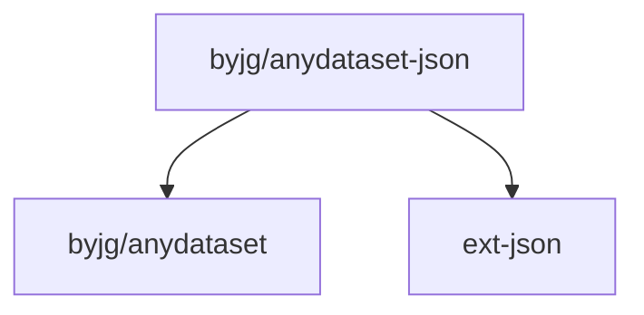

# JSON Dataset Abstraction

[](https://github.com/sponsors/byjg)
[](https://github.com/byjg/php-anydataset-json/actions/workflows/phpunit.yml)
[](http://opensource.byjg.com)
[](https://github.com/byjg/php-anydataset-json/)
[](https://opensource.byjg.com/opensource/licensing.html)
[](https://github.com/byjg/uri/releases/)

JSON abstraction dataset. Anydataset is an agnostic data source abstraction layer in PHP. 

See more about Anydataset [here](https://opensource.byjg.com/anydataset).

## Concept

The AnyDataset-Json is an abstraction layer to read a JSON data and transform it into a dataset, 
and you can manipulate it as a table.

Some features:

 - Read a JSON file or string
 - Navigate through nested JSON structures using path notation
 - Define and extract fields with validation
 - Create dynamic fields using closures
 - Validate data types (string, int, float, bool)
 - Handle required fields and default values

### Basic Example

**example.json:**
```json title="example.json"
{
   "menu":{
      "header":"SVG Viewer",
      "items":[
         {
            "id":"Open",
            "metadata":{
               "version":"1",
               "date":"NA"
            }
         },
         {
            "id":"OpenNew",
            "label":"Open New",
            "metadata":{
               "version":"2",
               "date":"2021-10-01"
            }
         }
      ]
   }
}
```

**example.php:**
```php title="example.php"
$json = file_get_contents('example.json');

$dataset = new \ByJG\AnyDataset\Json\JsonDataset($json);

// Basic usage with field definitions
$iterator = $dataset->getIterator("/menu/items")
                        ->withFields([
                            \ByJG\AnyDataset\Json\JsonFieldDefinition::create("name", "id"),
                            \ByJG\AnyDataset\Json\JsonFieldDefinition::create("version", "metadata/version")
                                ->required()
                                ->ofTypeString()
                        ]);

foreach ($iterator as $row) {
    echo $row->get('name');       // Print "Open", "OpenNew"
    echo $row->get('version');    // Print "1", "2"
}
```

## Features

- [Simple Manipulation](simple)
- [Creating dynamic fields](dynamic-fields)
- [The JsonFieldDefinition](jsonfielddefinition)


## Install

```bash
composer require "byjg/anydataset-json"
```

## Running the Unit tests

```bash
vendor/bin/phpunit
```

## Dependencies



----
[Open source ByJG](http://opensource.byjg.com)
