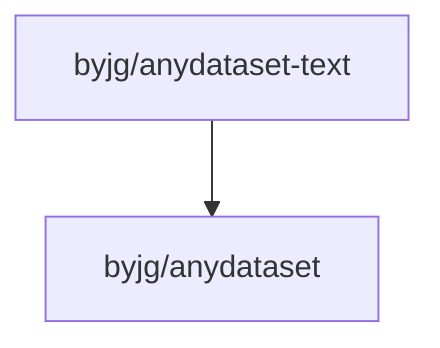

# Text File Abstraction Dataset

[](https://github.com/sponsors/byjg)
[](https://github.com/byjg/php-anydataset-text/actions/workflows/phpunit.yml)
[](http://opensource.byjg.com)
[](https://github.com/byjg/php-anydataset-text/)
[](https://opensource.byjg.com/opensource/licensing.html)
[](https://github.com/byjg/php-anydataset-text/releases/)

Text file abstraction dataset. Anydataset is an agnostic data source abstraction layer in PHP.

See more about Anydataset [here](https://opensource.byjg.com/anydataset).

## Features

- Read and parse delimited text files (CSV, etc.)
- Read and parse fixed-width text files
- Support for remote files via HTTP/HTTPS
- Conditional field parsing based on field values
- Output formatting to CSV or fixed-width formats

## Documentation

- [TextFileDataset](TextFileDataset) - Work with delimited text files (CSV, etc.)
- [FixedTextFileDataset](FixedTextFileDataset) - Work with fixed-width text files
- [FixedTextDefinition](FixedTextDefinition) - Define the structure of fixed-width text files
- [Formatters](Formatters) - Output dataset content in specific formats

## Quick Examples

### Text File Delimited (CSV)

This type of files uses a delimiter to define each field. The most common format is CSV but you can use your own based on a regular expression.
The class TextFileDataset has three constants with pre-defined formats:

- TextFileDataset::CSVFILE - A generic file definition. It accepts `|`, `,` and `;` as delimiter.
- TextFileDataset::CSVFILE_COMMA - The CSV file. It accepts only `,` as delimiter.
- TextFileDataset::CSVFILE_SEMICOLON - A CSV variation. It accepts only `;` as delimiter. 

example1.csv
```csv
Joao;Magalhaes
John;Doe
Jane;Smith
```
example1.php
```php
<?php
$file = "example1.csv";
    
$dataset = \ByJG\AnyDataset\Text\TextFileDataset::getInstance($file)
    ->withFields(["name", "surname"])
    ->withFieldParser(\ByJG\AnyDataset\Text\TextFileDataset::CSVFILE);
$iterator = $dataset->getIterator();

foreach ($iterator as $row) {
    echo $row->get('name');     // Print "Joao", "John", "Jane"
    echo $row->get('surname');  // Print "Magalhaes", "Doe", "Smith"
}
```

### Text File Delimited (CSV) - Get field names from first line

example2.csv
```csv
firstname;lastname
John;Doe
Jane;Smith
```

example2.php
```php
<?php
$file = "example2.csv";
    
// If omit `withFields` will get the field names from first line of the file
$dataset = \ByJG\AnyDataset\Text\TextFileDataset::getInstance($file)
    ->withFieldParser(\ByJG\AnyDataset\Text\TextFileDataset::CSVFILE);
$iterator = $dataset->getIterator();

foreach ($iterator as $row) {
    echo $row->get('firstname');     // Print "John", "Jane"
    echo $row->get('lastname');  // Print "Doe", "Smith"
}
```

### Text File Fixed sized columns

This file has the field defined by its position on the line. It is necessary to define the name, type, position and field length for each field to parse the file.
This definition also allows setting up required values and sub-types based on a value.

The field definition is created using the `FixedTextDefinition` class and it has the following parameters:

```php
$definition = new \ByJG\AnyDataset\Text\Definition\FixedTextDefinition(
    $fieldName,      # The field name
    $startPos,       # The start position of this field in the row
    $length,         # The number of characters of the field content
    $type,           # (optional) The type of the field content. TextTypeEnum::STRING (default) or TextTypeEnum::NUMBER
    $requiredValue,  # (optional) an array of valid values. E.g. ['Y', 'N']
    $subTypes        # (optional) An associative array of FixedTextDefinition. If the value matches with the key of the associative array, 
                     # then a sub set of FixedTextDefinition is processed. e.g.
                     # [
                     #    "Y" => [
                     #      new FixedTextDefinition(...),
                     #      new FixedTextDefinition(...),
                     #    ],
                     #    "N" => new FixedTextDefinition(...)
                     # ]
);
```

Example:

```php
<?php
$file = "".
    "001JOAO   S1520\n".
    "002GILBERTS1621\n";

$fieldDefinition = [
    new \ByJG\AnyDataset\Text\Definition\FixedTextDefinition('id', 0, 3, \ByJG\AnyDataset\Text\Definition\TextTypeEnum::NUMBER),
    new \ByJG\AnyDataset\Text\Definition\FixedTextDefinition('name', 3, 7, \ByJG\AnyDataset\Text\Definition\TextTypeEnum::STRING),
    new \ByJG\AnyDataset\Text\Definition\FixedTextDefinition('enable', 10, 1, \ByJG\AnyDataset\Text\Definition\TextTypeEnum::STRING, ['S', 'N']), // Required values --> S or N
    new \ByJG\AnyDataset\Text\Definition\FixedTextDefinition('code', 11, 4, \ByJG\AnyDataset\Text\Definition\TextTypeEnum::NUMBER),
];

$dataset = new \ByJG\AnyDataset\Text\FixedTextFileDataset($file)
    ->withFieldDefinition($fieldDefinition);

$iterator = $dataset->getIterator();
foreach ($iterator as $row) {
    echo $row->get('id');
    echo $row->get('name');
    echo $row->get('enable');
    echo $row->get('code');
}
```

### Text File Fixed sized columns with conditional type of fields

```php
<?php
$file = "".
    "001JOAO   S1520\n".
    "002GILBERTS1621\n";

$fieldDefinition = [
    new \ByJG\AnyDataset\Text\Definition\FixedTextDefinition('id', 0, 3, \ByJG\AnyDataset\Text\Definition\TextTypeEnum::NUMBER),
    new \ByJG\AnyDataset\Text\Definition\FixedTextDefinition('name', 3, 7, \ByJG\AnyDataset\Text\Definition\TextTypeEnum::STRING),
    new \ByJG\AnyDataset\Text\Definition\FixedTextDefinition(
        'enable',
        10,
        1,
        \ByJG\AnyDataset\Text\Definition\TextTypeEnum::STRING,
        null,
        [
            "S" => [
                new \ByJG\AnyDataset\Text\Definition\FixedTextDefinition('first', 11, 1, \ByJG\AnyDataset\Text\Definition\TextTypeEnum::STRING),
                new \ByJG\AnyDataset\Text\Definition\FixedTextDefinition('second', 12, 3, \ByJG\AnyDataset\Text\Definition\TextTypeEnum::STRING),
            ],
            "N" => [
                new \ByJG\AnyDataset\Text\Definition\FixedTextDefinition('reason', 11, 4, \ByJG\AnyDataset\Text\Definition\TextTypeEnum::STRING),
            ]
        ]
    ),
];

$dataset = new \ByJG\AnyDataset\Text\FixedTextFileDataset($file)
    ->withFieldDefinition($fieldDefinition);

$iterator = $dataset->getIterator();
foreach ($iterator as $row) {
    echo $row->get('id');
    echo $row->get('name');
    echo $row->get('enable');
    echo $row->get('first');       // Not empty if `enable` == "S"
    echo $row->get('second');      // Not empty if `enable` == "S"
    echo $row->get('reason');      // Not empty if `enable` == "N"
}
```

### Read from remote URL

Both `TextFileDataset` and `FixedTextFileDataset` support reading files from remote HTTP or HTTPS URLs.

## Formatters

This package implements two formatters:

- CSVFormatter - output the content as CSV File (field delimited)
- FixedSizeColumnFormatter - output the content with columns defined by length.

[Click here](http://opensource.byjg.com/php/anydataset.html#formatters) for more information about formatters.

### CSVFormatter

```php
$formatter = new \ByJG\AnyDataset\Text\Formatter\CSVFormatter($anydataset->getIterator());
$formatter->setDelimiter(string);  # Default: ,
$formatter->setQuote(string);  # Default: "
$formatter->setApplyQuote(CSVFormatter::APPLY_QUOTE_ALWAYS | CSVFormatter::APPLY_QUOTE_WHEN_REQUIRED | CSVFormatter::APPLY_QUOTE_ALL_STRINGS | CSVFormatter::NEVER_APPLY_QUOTE); # Default: APPLY_QUOTE_WHEN_REQUIRED
$formatter->setOutputHeader(true|false);  # Default: true
$formatter->toText();
```

### FixedSizeColumnFormatter

```php
$fieldDefinition = [ ... ];  # See above about field definition

$formatter = new \ByJG\AnyDataset\Text\Formatter\FixedSizeColumnFormatter($anydataset->getIterator(), $fieldDefinition);
$formatter->setPadNumber(string);  # Default: 0
$formatter->setPadString(string);  # Default: space character
$formatter->toText();
```

## Install

```
composer require "byjg/anydataset-text"
```

## Running Unit tests

```bash
vendor/bin/phpunit
```

## Dependencies



----
[Open source ByJG](http://opensource.byjg.com)