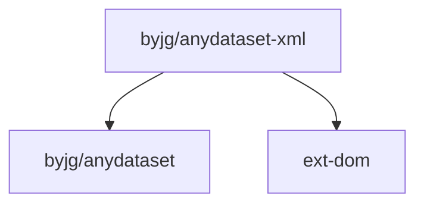

# AnyDataset-Xml

[](https://github.com/sponsors/byjg)
[](https://github.com/byjg/php-anydataset-xml/actions/workflows/phpunit.yml)
[](http://opensource.byjg.com)
[](https://github.com/byjg/php-anydataset-xml/)
[](https://opensource.byjg.com/opensource/licensing.html)
[](https://github.com/byjg/php-anydataset-xml/releases/)

XML abstraction dataset for the AnyDataset library. AnyDataset is an agnostic data source abstraction layer in PHP.

## Features

- **Simple XML Processing**: Process XML data with a clean, consistent API
- **XPath Support**: Use XPath expressions to select nodes and attributes
- **Namespace Support**: Full support for XML namespaces
- **Repeated Node Handling**: Automatically handles repeated nodes by returning arrays
- **Custom Field Processing**: Define custom field mappings with closures/callbacks
- **Flexible Input**: Accept XML as string, DOMDocument, XmlNode, or File object
- **AnyDataset Integration**: Compatible with the AnyDataset abstraction layer

## Documentation

- [XmlDataset](XmlDataset) - Main class for working with XML data
- [XPath Expressions](XPath-Expressions) - Guide to using XPath in the library

## Installation

```bash
composer require "byjg/anydataset-xml"
```

## Quick Example

```php
<?php
$xml = file_get_contents('example.xml');

$dataset = new \ByJG\AnyDataset\Xml\XmlDataset(
    $xml,        // The XML string, can also be an XmlNode, DOMDocument, or File object
    "book",      // The node that represents a row
    [
        "category" => "@category",
        "title" => "title",
        "lang" => "title/@lang",
        "lang2" => function ($row) {
            return substr($row->get('lang'), 0, 2);
        }
    ] // Mapping columns
);

$iterator = $dataset->getIterator();
foreach ($iterator as $row) {
    echo $row->get('category'); // Print COOKING, CHILDREN, WEB
    echo $row->get('title');    // Print Everyday Italian, Harry Potter, Learning XML
    echo $row->get('lang');     // Print en-US, de-DE, pt-BR
    echo $row->get('lang2');    // Print en, de, pt
}
```

## Dependencies



## Running the Unit Tests

```bash
vendor/bin/phpunit
```

----
[Open source ByJG](http://opensource.byjg.com)
