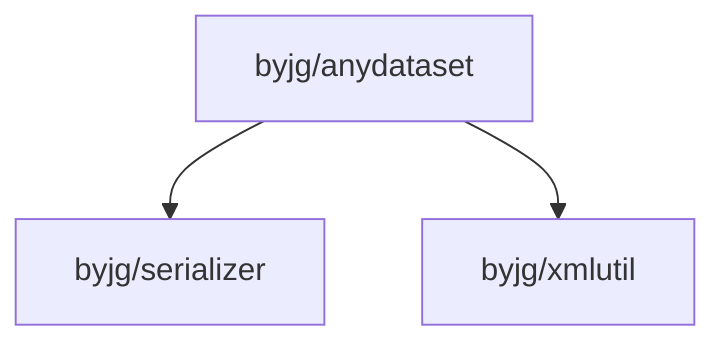

# AnyDataset

[](https://github.com/sponsors/byjg)
[](https://github.com/byjg/php-anydataset/actions/workflows/phpunit.yml)
[](http://opensource.byjg.com)
[](https://github.com/byjg/php-anydataset/)
[](https://opensource.byjg.com/opensource/licensing.html)
[](https://github.com/byjg/php-anydataset/releases/)

AnyDataset is a powerful data source abstraction layer for PHP that provides a **simple and consistent interface** to access different data sources. 
With AnyDataset, you can work with various data formats and storage systems using the same programming interface.

It is the core component of the [Anydataset project](https://packagist.org/providers/byjg/anydataset-implementation), an agnostic data source abstraction layer for PHP.

## Key Features

- **Unified Interface**: Access different data sources (databases, arrays, XML, JSON, etc.) using the same interface
- **Flexible Iteration**: Multiple ways to iterate through your data
- **Powerful Filtering**: Filter your data using a SQL-like syntax
- **Data Transformation**: Convert between different formats (JSON, XML, arrays)
- **Validation**: Validate your data against rules
- **Extensible**: Create your own data source implementations

## Quick Start

### Installation

```bash
composer require "byjg/anydataset"
```

### Basic Usage

```php
<?php
# Create a dataset
$dataset = new \ByJG\AnyDataset\Core\AnyDataset("example");

# Get an iterator
$iterator = $dataset->getIterator();

# Iterate over the results
foreach ($iterator as $row) {
    print_r($row->toArray());
}
```

## Documentation

### Core Concepts
- [AnyDataset Overview](anydataset-overview) - Core component overview and usage
- [The Row Object](row) - Working with data rows
- [Iterators](iterators) - Different ways to iterate through data

### Advanced Features
- [Filtering Results](iteratorfilter) - How to filter your data
- [Formatting Output](rowoutput) - Transform your data into different formats
- [Field Validation](rowvalidator) - Validate your data against rules
- [Data Population](populate) - Populate objects with data

## Available Implementations

| Data Source Type      | Implementation         | Read/Write | Repository                                          |
|-----------------------|------------------------|:----------:|-----------------------------------------------------|
| **Core**              | AnyDataSet             |    R/W     | [Github](https://github.com/byjg/anydataset)        |
| **Databases**         | DbDriverInterface      |    R/W     | [Github](https://github.com/byjg/anydataset-db)     |
| **Arrays**            | ArrayDataSet           |     R      | [Github](https://github.com/byjg/anydataset-array)  |
| **Text Files**        | TextFileDataSet        |     R      | [Github](https://github.com/byjg/anydataset-text)   |
| **Fixed Width Files** | FixedTextFileDataSet   |     R      | [Github](https://github.com/byjg/anydataset-text)   |
| **XML**               | XmlDataSet             |     R      | [Github](https://github.com/byjg/anydataset-xml)    |
| **JSON**              | JSONDataSet            |     R      | [Github](https://github.com/byjg/anydataset-json)   |
| **SparQL**            | SparQLDataSet          |     R      | [Github](https://github.com/byjg/anydataset-sparql) |
| **NoSQL Document**    | NoSqlDocumentInterface |    R/W     | [Github](https://github.com/byjg/anydataset-nosql)  |
| **NoSQL Key/Value**   | KeyValueInterface      |    R/W     | [Github](https://github.com/byjg/anydataset-nosql)  |

## Example Code Snippets

### Filtering Data

```php
<?php
$filter = new \ByJG\AnyDataset\Core\IteratorFilter();
$filter->addRelation("field1", \ByJG\AnyDataset\Core\Enum\Relation::EQUAL, 10);
$iterator = $dataset->getIterator($filter);
```

### Using Formatters

```php
<?php
$formatter = new XmlFormatter($anydataset->getIterator());
$formatter->raw();                           // Return a DOM object
$formatter->toText();                        // Return the XML as a text
$formatter->saveToFile("/path/to/file.xml"); // Save the XML Text to a file
```

## Running Unit Tests

```bash
vendor/bin/phpunit
```

## Dependencies



----
[Open source ByJG](http://opensource.byjg.com)