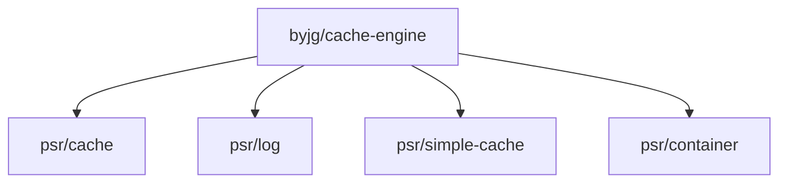

# Cache Engine

[](https://github.com/byjg/php-cache-engine/actions/workflows/phpunit.yml)
[](http://opensource.byjg.com)
[](https://github.com/byjg/php-cache-engine/)
[](https://opensource.byjg.com/opensource/licensing.html)
[](https://github.com/byjg/php-cache-engine/releases/)


A multipurpose cache engine PSR-6 and PSR-16 implementation with several drivers.

## PSR-16
 
PSR-16 defines a Simple Cache interface with less verbosity than PSR-6. Below a list
of engines available in this library that is PSR-16 compliant:

PSR-16 Getting Started: [here](basic-usage-psr16-simplecache)

## PSR-6

The PSR-6 implementation use the engines defined above. PSR-6 is more verbosity and
have an extra layer do get and set the cache values.

You can use one of the factory methods to create a instance of the CachePool implementation:

PSR-6 Getting Started: [here](basic-usage-psr6-cachepool)

## List of Cache Engines

| Class                                                                                            | Description                                                            |
|:-------------------------------------------------------------------------------------------------|:-----------------------------------------------------------------------|
| [\ByJG\Cache\Psr16\NoCacheEngine](class-no-cache-engine)                                 | Do nothing. Use it for disable the cache without change your code      |
| [\ByJG\Cache\Psr16\ArrayCacheEngine](class-array-cache-engine)                           | Local cache only using array. It does not persists between requests    |
| [\ByJG\AnyDataset\NoSql\Cache\KeyValueCacheEngine](https://github.com/byjg/php-anydataset-nosql) | Use S3-Like or ClouflareKV as a store for the cache (other repository) |
| [\ByJG\Cache\Psr16\FileSystemCacheEngine](class-filesystem-cache-engine)                 | Save the cache result in the local file system                         |
| [\ByJG\Cache\Psr16\MemcachedEngine](class-memcached-engine)                              | Uses the Memcached as the cache engine                                 |
| [\ByJG\Cache\Psr16\TmpfsCacheEngine](class-tmpfs-cache-engine)                           | Uses the Tmpfs as the cache engine                                     |
| [\ByJG\Cache\Psr16\RedisCachedEngine](class-redis-cache-engine)                          | uses the Redis as cache                                                |
| [\ByJG\Cache\Psr16\SessionCachedEngine](class-session-cache-engine)                      | uses the PHP session as cache                                          |
| [\ByJG\Cache\Psr16\ShmopCachedEngine](class-shmop-cache-engine)                          | uses the shared memory area for cache                                  |


## Logging cache commands
 
You can add a PSR Log compatible to the constructor in order to get Log of the operations

See log examples [here](setup-log-handler)

## Use a PSR-11 container to retrieve the cache keys

You can use a PSR-11 compatible to retrieve the cache keys. 

See more [here](psr11-usage)

## Install

Just type: 

```
composer require "byjg/cache-engine"
```


## Running Unit Testes

```
vendor/bin/phpunit --stderr
```

**Note:** the parameter `--stderr` after `phpunit` is to permit run the tests on SessionCacheEngine.  

## Dependencies


----
[Open source ByJG](http://opensource.byjg.com)
