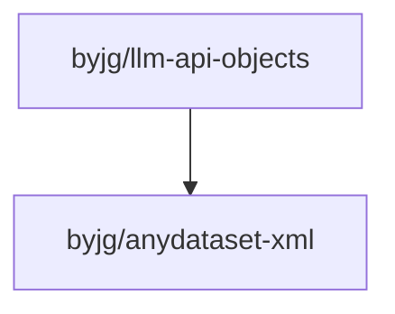

# LLM API Objects

[](https://github.com/sponsors/byjg)
[](https://github.com/byjg/llm-api-objects/actions/workflows/phpunit.yml)
[](http://opensource.byjg.com)
[](https://github.com/byjg/llm-api-objects/)
[](https://opensource.byjg.com/opensource/licensing.html)
[](https://github.com/byjg/llm-api-objects/releases/)

Strongly-typed PHP model layer for building OpenAI Chat Completions API request payloads.
Works with both OpenAI and Ollama (via the `/v1` OpenAI-compatible endpoint) using the [`openai-php/client`](https://github.com/openai-php/client).

## Features

- Strongly-typed models for Chat Completions requests
- Full support for function calling (tools): `Tool`, `ToolFunction`, `ToolParameter`, `ToolChoice`
- Multi-turn conversations with `role=tool` messages and `tool_call_id`
- Automatic message splitting when content exceeds a token limit
- Delimiter-based message partitioning
- Compatible with OpenAI and Ollama (`/v1` endpoint)
- Ollama model tuning parameters via `ModelFileParameters`
- Jira XML/RSS importers to seed conversation context

## Documentation

- [Getting Started](getting-started) — Installation and first request
- [Chat Model](chat) — Building and sending chat requests
- [Messages](messages) — Roles, content, `tool_call_id`, `tool_calls`
- [Tools](tools) — Function calling: Tool, ToolFunction, ToolParameter, ToolChoice
- [Model Parameters](model-parameters) — Ollama model tuning parameters
- [Importers](importers) — Jira XML/RSS importers

## Quick Examples

### Basic chat with OpenAI

```php
<?php
require 'vendor/autoload.php';

$client = OpenAI::factory()
    ->withApiKey($_ENV['OPENAI_API_KEY'])
    ->make();

$chat = new \ByJG\LlmApiObjects\Model\Chat(
    model: 'gpt-4o',
    messages: [
        new \ByJG\LlmApiObjects\Model\Message(
            role: \ByJG\LlmApiObjects\Enum\Role::user,
            message: 'What is the capital of France?',
        ),
    ],
    system: 'You are a helpful geography assistant.',
);

$result = $client->chat()->create($chat->toApi());
echo $result->choices[0]->message->content;
```

### Basic chat with Ollama

```php
<?php
$client = OpenAI::factory()
    ->withApiKey('ollama')
    ->withBaseUri('http://localhost:11434/v1')
    ->make();

$chat = new \ByJG\LlmApiObjects\Model\Chat(
    model: 'llama3',
    messages: [
        new \ByJG\LlmApiObjects\Model\Message(
            role: \ByJG\LlmApiObjects\Enum\Role::user,
            message: 'Hello!',
        ),
    ],
);

$result = $client->chat()->create($chat->toApi());
echo $result->choices[0]->message->content;
```

### Function calling (tools)

```php
<?php
use ByJG\LlmApiObjects\Enum\ToolChoice;
use ByJG\LlmApiObjects\Model\Chat;
use ByJG\LlmApiObjects\Model\Message;
use ByJG\LlmApiObjects\Enum\Role;
use ByJG\LlmApiObjects\Tool\Tool;
use ByJG\LlmApiObjects\Tool\ToolFunction;
use ByJG\LlmApiObjects\Tool\ToolParameter;

$weatherTool = new Tool(
    new ToolFunction(
        name: 'get_current_weather',
        description: 'Get the current weather in a given location',
        parameters: [
            new ToolParameter(name: 'location', type: 'string', description: 'City name', required: true),
            new ToolParameter(name: 'unit', type: 'string', enum: ['celsius', 'fahrenheit']),
        ],
    ),
);

$chat = new Chat(
    model: 'gpt-4o',
    messages: [
        new Message(role: Role::user, message: "What's the weather in Paris?"),
    ],
);
$chat->addTool($weatherTool);
$chat->setToolChoice(ToolChoice::auto);

$result = $client->chat()->create($chat->toApi());
```

## Install

```bash
composer require byjg/llm-api-objects
```

## Running Unit Tests

```bash
composer test
```

## Dependencies



----
[Open source ByJG](http://opensource.byjg.com)
