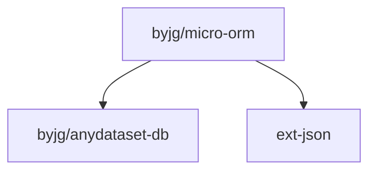

# MicroOrm for PHP

[](https://github.com/byjg/php-micro-orm/actions/workflows/phpunit.yml)
[](http://opensource.byjg.com)
[](https://github.com/byjg/php-micro-orm/)
[](https://opensource.byjg.com/opensource/licensing.html)
[](https://github.com/byjg/php-micro-orm/releases/)

A micro framework for create a very simple decoupled ORM.
This library intended to be very small and very simple to use;

Key Features:

* Can be used with any DTO, Entity, Model or whatever class with public properties or with getter and setter
* The repository support a variety of datasources: MySql, Sqlite, Postgres, MySQL, Oracle (see byjg/anydataset)
* A class Mapper is used for mapping the Entity and the repository
* Small and simple to use

## Architecture

These are the key components:

```text
┌──────────────────────────┐
│ Repository               │              ┌─────────────────────┐
│                          │         ┌────│        Model        │
│                          │         │    └─────────────────────┘
│          ┌───────────────┴─────┐   │               │
│          │       Mapper        │───┤               │
│          └───────────────┬─────┘   │               │
│                     │    │         │    ┌─────────────────────┐
│                     │    │         └────│    FieldMapping     │
│                     │    │              └─────────────────────┘
│                     │    │
│          ┌───────────────┴─────┐
│          │        Query        │
│          └───────────────┬─────┘
│                          │
│          ┌───────────────┴─────┐
│          │  DbDriverInterface  │───────────────┐
│          └───────────────┬─────┘               │
│                          │                     │
└──────────────────────────┘                .─────────.
                                           │           │
                                           │`─────────'│
                                           │           │
                                           │    DB     │
                                           │           │
                                           │           │
                                            `─────────'
```

* Model is a get/set class to retrieve or save the data into the database
* Mapper will create the definitions to map the Model into the Database.
* Query will use the Mapper to prepare the query to the database based on DbDriverInterface
* DbDriverIntarce is the implementation to the Database connection.
* Repository put all this together

## Basics

* [Defining the Model](getting-started-model)
* [Querying the Database](querying-the-database)
* [Updating the database](updating-the-database)
* [Using the Mapper Object](using-mapper-object)

## Advanced Topics

* [The Literal Object](the-literal-object)
* [Observing the Database](observers)
* [Controlling the data queried/updated](controlling-the-data)
* [Using FieldAlias](using-fieldalias)
* [Tables without auto increments fields](tables-without-auto-increment-fields)
* [Using With Recursive SQL Command](using-with-recursive-sql-command)


## Install

Just type:

```bash
composer require "byjg/micro-orm"
```

## Running Tests

```bash
./vendor/bin/phpunit
```

## Related Projects

* [Database Migration](https://github.com/byjg/migration)
* [Anydataset](https://github.com/byjg/anydataset)
* [PHP Rest Template](https://github.com/byjg/php-rest-template)
* [USDocker](https://github.com/usdocker/usdocker)
* [Serializer](https://github.com/byjg/serializer)

## Dependencies



----
[Open source ByJG](http://opensource.byjg.com)
