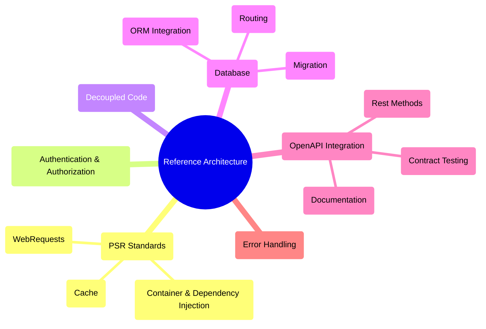

# PHP REST Reference Architecture

[](https://github.com/sponsors/byjg)
[](https://github.com/byjg/php-rest-reference-architecture/actions/workflows/build-app-image.yml)
[](http://opensource.byjg.com)
[](https://github.com/byjg/php-rest-reference-architecture)
[](https://opensource.byjg.com/opensource/licensing.html)
[](https://github.com/byjg/php-rest-reference-architecture/releases)
[](https://scrutinizer-ci.com/g/byjg/php-rest-reference-architecture/?branch=6.0)

**Production-ready PHP REST API boilerplate** that lets you focus on building your business logic, not the infrastructure.

## Why Use This?

Stop wasting time configuring infrastructure. This template provides everything you need to build professional REST APIs:

- ✅ **Start coding in minutes** - Not hours or days
- ✅ **Production-ready** - Security, authentication, and best practices built-in
- ✅ **Code generator** - Automatically create CRUD operations from database tables
- ✅ **Two architectural patterns** - Choose between Repository or ActiveRecord
- ✅ **OpenAPI documentation** - Auto-generated, always in sync
- ✅ **Fully tested** - Includes a functional test suite
- ✅ **Docker-ready** - Containerized development and deployment

## Quick Start

```bash
# Create your project
composer -sdev create-project byjg/rest-reference-architecture my-api ^6.0

# Start containers
cd my-api
docker compose -f docker-compose.yml up -d

# Run migrations
composer migrate -- --env=dev reset

# Your API is ready!
curl http://localhost:8080/sample/ping
```

**📚 [Complete Getting Started Guide →](getting_started)**

## Architecture Overview



## Key Features

### 🚀 Code Generation
Automatically generate Models, Repositories, Services, REST Controllers, and Tests from your database schema.

```bash
composer codegen -- --env=dev --table=users all --save
```

**📚 [Code Generator Documentation →](code_generator)**

### 🏗️ Two Architectural Patterns

**Repository Pattern** (default)
- Clean separation of concerns
- Service layer for business logic
- Full dependency injection

**ActiveRecord Pattern**
- Rapid prototyping
- Less boilerplate
- Direct database access from models

**📚 [Choose Your Pattern →](code_generator.md#what-it-generates)**

### 🔐 Authentication & Authorization Built-in

- JWT-based authentication
- Role-based access control (RBAC)
- Secure by default
- Ready-to-use login endpoints

**📚 [Authentication Guide →](login)**

### 📖 OpenAPI Integration

- Auto-generated documentation
- Interactive API explorer (Swagger UI)
- Always synchronized with your code
- Contract testing support

**📚 [REST API Documentation →](rest)**

### 🗄️ Database Management

**Migrations**
- Version control your database schema
- Up/down migration support
- Zero-downtime deployments

**📚 [Migration Guide →](migration)**

**ORM Integration**
- MicroORM for lightweight data access
- Query builder
- Relationship mapping

**📚 [ORM Documentation →](orm)**

### 🧪 Testing Built-in

- Functional test suite included
- Test helpers and fixtures
- OpenAPI contract testing
- Supports custom test scenarios

**📚 [Testing Guide →](functional_test)**

### 🐳 Docker Ready

- Pre-configured Docker setup
- Development and production configurations
- MySQL, PHP-FPM, and Nginx
- One command to start

### 🔧 Scriptify - Interactive Development

- **Interactive PHP Terminal**: REPL with your project's autoloader
- **CLI Script Runner**: Execute any PHP method from command line
- **Service Management**: Install PHP classes as system daemons
- Quick prototyping and debugging

```bash
composer terminal  # Start interactive PHP shell
```

**📚 [Scriptify Guide →](scriptify)**

### ⚙️ Modern PHP Standards

Implements PSR standards:
- PSR-7: HTTP Message Interface
- PSR-11: Container Interface
- PSR-6 & PSR-16: Cache Interface
- And more...

**📚 [PSR-11 Container →](psr11)** | **[Dependency Injection →](psr11_di)**

## What's Included

| Feature              | Description                        | Documentation                      |
|----------------------|------------------------------------|------------------------------------|
| **Code Generator**   | Generate CRUD from database tables | [→ Docs](code_generator)   |
| **REST API**         | OpenAPI-documented endpoints       | [→ Docs](rest)             |
| **Authentication**   | JWT with role-based access         | [→ Docs](login)            |
| **Database**         | Migrations + ORM                   | [→ Docs](migration)        |
| **Testing**          | Functional test suite              | [→ Docs](functional_test)  |
| **Service Layer**    | Business logic separation          | [→ Docs](services)         |
| **Scriptify**        | Interactive terminal & CLI scripts | [→ Docs](scriptify)        |
| **Unattended Setup** | CI/CD friendly installation        | [→ Docs](unattended_setup) |

## Documentation

### Getting Started
1. **[Installation & Setup](getting_started)** – Install the template, configure environments, and review prerequisites.
2. **[Create Your First Table](getting_started_01_create_table)** – Define your first migration and schema.
3. **[Add Fields](getting_started_02_add_new_field)** – Safely evolve existing tables.
4. **[Create REST Endpoints](getting_started_03_create_rest_method)** – Generate REST handlers from your tables.

### Build Your API
- **[Code Generator](code_generator)** – Automate models, repositories, services, controllers, and tests.
- **[REST API](rest)** – Implement endpoints that stay in sync with OpenAPI contracts.
- **[Authentication](login)** – Configure JWT login flows and RBAC enforcement.
- **[Database Migration](migration)** – Version and run schema migrations in every environment.
- **[ORM](orm)** – Use MicroORM for repository and ActiveRecord patterns.
- **[Service Layer](services)** – Organize business logic and transaction boundaries.
- **[Service Patterns](service-patterns)** – Adopt advanced orchestration, validation, and DTO patterns.
- **[Repository Patterns](repository-advanced)** – Implement complex queries, UUID handling, and filtering helpers.
- **[Attributes System](attributes)** – Apply RequireRole, ValidateRequest, and custom attributes to controllers.
- **[Traits Reference](traits)** – Reuse timestamp and soft-delete helpers inside models.
- **[Template Customization](templates)** – Tailor the generator templates to match your coding standards.

### Architecture & Operations
- **[Configuration Deep Dive](configuration-advanced)** – Layer configurations, secrets, and environment overrides.
- **[Architecture Decisions](architecture-decisions)** – Decide when to use Repository or ActiveRecord implementations.
- **[PSR-11 Container](psr11)** – Understand the default container bindings that power `src/`.
- **[Dependency Injection](psr11_di)** – Wire repositories, services, and factories through the container.
- **[Scriptify](scriptify)** – Use the REPL, CLI runner, and service manager utilities.
- **[Unattended Setup](unattended_setup)** – Automate installs for CI/CD pipelines.
- **[Windows Setup](windows)** – Follow the WSL/Windows specific checklist.

### Testing & Quality
- **[Complete Testing Guide](testing-guide)** – Unit, integration, and contract testing reference.
- **[Functional Tests](functional_test)** – Use `FakeApiRequester` and fixtures for end-to-end coverage.
- **[JWT Authentication Advanced](jwt-advanced)** – Extend tokens with custom claims and refresh logic.
- **[Error Handling](error-handling)** – Map exceptions to HTTP responses and logging patterns.

## Real-World Example

```bash
# 1. Create database table
cat > db/migrations/up/00002-create-products.sql << 'EOF'
CREATE TABLE products (
    id INT AUTO_INCREMENT PRIMARY KEY,
    name VARCHAR(100) NOT NULL,
    price DECIMAL(10,2) NOT NULL,
    created_at TIMESTAMP DEFAULT CURRENT_TIMESTAMP
);
EOF

# 2. Run migration
composer migrate -- --env=dev update

# 3. Generate all code
composer codegen -- --env=dev --table=products all --save

# 4. Your CRUD API is ready!
curl http://localhost:8080/products
```

You just created a complete CRUD API with:
- ✅ Model with validation
- ✅ Repository for data access
- ✅ Service for business logic
- ✅ REST controller with GET, POST, PUT endpoints
- ✅ Functional tests
- ✅ OpenAPI documentation
- ✅ JWT authentication

## Requirements

- PHP 8.3+ (8.5 recommended)
- Docker & Docker Compose (optional but recommended)
- Composer
- Git

## Support & Community

- 📖 **[Full Documentation](getting_started)**
- 🐛 **[Report Issues](https://github.com/byjg/php-rest-reference-architecture/issues)**
- 💡 **[Request Features](https://github.com/byjg/php-rest-reference-architecture/issues)**
- 🌐 **[ByJG Open Source](http://opensource.byjg.com)**

## Not a Framework

This is a **template**, not a framework. You own the code:
- ✅ Full control over every file
- ✅ No vendor lock-in
- ✅ Customize anything you need
- ✅ Remove what you don't need

## License

This project is open source. See [LICENSE](https://opensource.byjg.com/opensource/licensing.html) for details.

## Dependencies

**📚 [Complete Component Dependency Graph →](components-dependency)**

---

**[Open source ByJG](http://opensource.byjg.com)**
