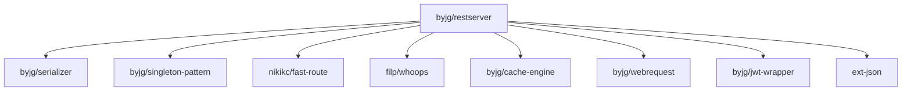

# PHP Rest Server

[](https://github.com/byjg/php-restserver/actions/workflows/phpunit.yml)
[](http://opensource.byjg.com)
[](https://github.com/byjg/php-restserver/)
[](https://opensource.byjg.com/opensource/licensing.html)
[](https://github.com/byjg/php-restserver/releases/)

Create RESTFull services with different and customizable output handlers (JSON, XML, Html, etc.).
Auto-Generate routes from swagger.json definition.

## Documentation

Setup:
- [Set up the RestServer](setup)

Creating and customizing routes:
- [Defining Route Names](defining-route-names)
- [Create Routes using Closures](routes-using-closures)
- [Create Routes Manually](routes-manually)
- [Create Routes using PHP Attributes](routes-using-php-attributes)
- [Auto-Generate from an OpenApi definition](autogenerator-routes-openapi) (**hot**)

Processing the request and output the response:
- [HttpRequest and HttpResponse object](httprequest-httpresponse)

Advanced:
- [Middleware](middleware)
- [Error Handler](error-handler)
- [Intercepting the Request](intercepting-request)
- [Caching Routes](caching-routes)

## Installation

```bash
composer require "byjg/restserver"
```

## Dependencies



----
[Open source ByJG](http://opensource.byjg.com)

