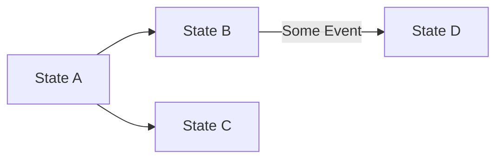
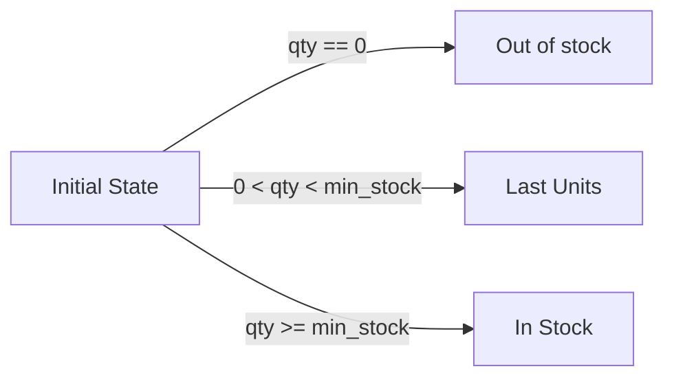
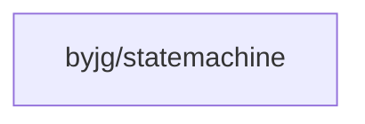

# State Machine

[](https://github.com/byjg/php-statemachine/actions/workflows/phpunit.yml)
[](http://opensource.byjg.com)
[](https://github.com/byjg/php-statemachine/)
[](https://opensource.byjg.com/opensource/licensing.html)
[](https://github.com/byjg/php-statemachine/releases/)

This component implements a Finite State Machine, which can define several states and group them in a collection
of transitions (from one state to another state). In addition, each state can have a conditional allowing move to another state.

Differently from other State machines, this implementation doesn't have an initial or final state.

## Documentation

- [Basic Usage](basic-usage)
- [Auto Transition](auto-transition)
- [Error Handling](error-handling)
- [Advanced Features](advanced-features)

## Basic Example

Let's use the following example.


We have the states A, B, C, and D, and it's their possible transitions.

First, we create the states:

```php
$stA = new State("A");
$stB = new State("B");
$stC = new State("C");
$stD = new State("D");
```

Then, we define the transitions. Each transition can optionally have a condition that implements `TransitionConditionInterface`. The `canTransition()` method receives the `data` array and returns `true` or `false` to allow or deny the transition.

```php
use ByJG\StateMachine\TransitionConditionInterface;

$transitionA_B = new Transition($stA, $stB);
$transitionA_C = new Transition($stA, $stC);

$condition = new class implements TransitionConditionInterface {
    public function canTransition(?array $data): bool {
        return !is_null($data);
    }
};
$transitionB_D = new Transition($stB, $stD, $condition);
```

After creating the states and the transition, we can create the State Machine:

```php
$stateMachine = FiniteStateMachine::createMachine()
    ->addTransition($transitionA_B)
    ->addTransition($transitionA_C)
    ->addTransition($transitionB_D);
```

We can validate the transition using the method `canTransition($from, $to)`. Some examples:

```php
$stateMachine->canTransition($stA, $stB);  // returns true
$stateMachine->canTransition($stA, $stC);  // returns true
$stateMachine->canTransition($stA, $stD);  // returns false
$stateMachine->canTransition($stB, $stA);  // returns false
$stateMachine->canTransition($stB, $stD);  // returns false
$stateMachine->canTransition($stB, $stD, ["some_info"]); // returns true
$stateMachine->canTransition($stC, $stD); //returns false
```

We can also check if a state is initial or final:

```php
$stateMachine->isInitialState($stA); // returns true
$stateMachine->isInitialState($stB); // returns false
$stateMachine->isFinalState($stA); // returns false
$stateMachine->isFinalState($stC); // returns true
$stateMachine->isFinalState($stD); // returns true
```

### Other ways to create the State Machine

Alternatively, you can create the state machine using the `createMachine` factory method with arguments as follows:

```php
$condition = new class implements TransitionConditionInterface {
    public function canTransition(?array $data): bool {
        return !is_null($data);
    }
};

$stateMachine = FiniteStateMachine::createMachine(
    [
        ['A', 'B'],
        ['A', 'C'],
        ['B', 'D', $condition]
    ]
);
```

## Using the Auto Transition

Another feature of this component is that depending on the state you are in and the
data you pass to the state machine, it can decide what is the next state you can be.

Let's analyze the following states.



The transition is only possible if some conditions are satisfied. So, let's create the state,
the possible transitions and its conditions.

```php
use ByJG\StateMachine\TransitionConditionInterface;

// States:
$stInitial = new State("__VOID__");
$stInStock = new State("IN_STOCK");
$stLastUnits = new State("LAST_UNITS");
$stOutOfStock = new State("OUT_OF_STOCK");

// Transition conditions:
$inStockCondition = new class implements TransitionConditionInterface {
    public function canTransition(?array $data): bool {
        return $data["qty"] >= $data["min_stock"];
    }
};

$lastUnitsCondition = new class implements TransitionConditionInterface {
    public function canTransition(?array $data): bool {
        return $data["qty"] > 0 && $data["qty"] < $data["min_stock"];
    }
};

$outOfStockCondition = new class implements TransitionConditionInterface {
    public function canTransition(?array $data): bool {
        return $data["qty"] == 0;
    }
};

// Transitions:
$transitionInStock = Transition::create($stInitial, $stInStock, $inStockCondition);
$transitionLastUnits = Transition::create($stInitial, $stLastUnits, $lastUnitsCondition);
$transitionOutOfStock = Transition::create($stInitial, $stOutOfStock, $outOfStockCondition);

// Create the Machine:
$stateMachine = FiniteStateMachine::createMachine()
    ->addTransition($transitionInStock)
    ->addTransition($transitionLastUnits)
    ->addTransition($transitionOutOfStock);
```

The method `autoTransitionFrom` will check if is possible to do the transition with the actual data
and to what state.

```php
$stateMachine->autoTransitionFrom($stInitial, ["qty" => 10, "min_stock" => 20]); // returns LAST_UNITS
$stateMachine->autoTransitionFrom($stInitial, ["qty" => 30, "min_stock" => 20]); // returns IN_STOCK
$stateMachine->autoTransitionFrom($stInitial, ["qty" => 0, "min_stock" => 20]); // returns OUT_OF_STOCK
```

When auto transitioned, the state object returned has the `->getData()` method with the data used to validate it.

### Processing State with Actions

You can also create a state with an action that will execute when the state is reached.

e.g.

```php
use ByJG\StateMachine\StateActionInterface;

$action = new class implements StateActionInterface {
    public function execute(?array $data): void {
        // Execute some operation with the data
        // This is the STATE action, not the transition condition
        echo "Processing state with: " . json_encode($data);
    }
};

$stN = new State('SOMESTATE', $action);

// After autoTransition returns the $stN state object
// You can execute its action:

$resultState = $stateMachine->autoTransitionFrom('STATE', [... data ...]);
$resultState->process(); // This will run the state's action with the data
```

**Note:** The `TransitionConditionInterface` validates transitions (returns true/false to allow/deny). The `StateActionInterface` executes actions when the state is processed.

## Other Methods

### Create multiple transitions

```php
$condition = new class implements TransitionConditionInterface {
    public function canTransition(?array $data): bool {
        return isset($data["approved"]) && $data["approved"] === true;
    }
};

$transitions = Transition::createMultiple([$from1, $from2], $to, $condition);

$machine = FiniteStateMachine::createMachine()
    ->addTransitions($transitions);
```

### Get possible states from a specific state

```php
$stateMachine->possibleTransitions($stA);
```

### Get the State object

```php
// Return null if doesn't exist, otherwise return the object State
$state = $stateMachine->state('OUT_OF_STOCK');
```

## Install

```bash
composer require "byjg/statemachine"
```

## Dependencies



----
[Open source ByJG](http://opensource.byjg.com)
