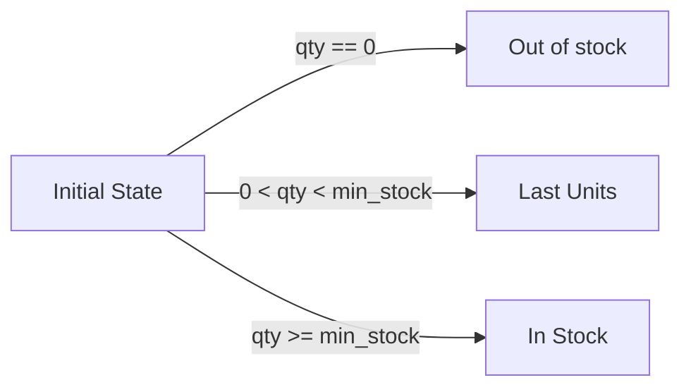

# Auto Transition

Another feature of this component is that depending on the state you are in and the
data you pass to the state machine, it can decide what is the next state you can be.

## Example: Stock Management

Let's analyze the following states:



The transition is only possible if some conditions are satisfied. So, let's create the state,
the possible transitions and its conditions.

### Creating States and Transitions

```php
use ByJG\StateMachine\TransitionConditionInterface;

// States:
$stInitial = new State("__VOID__");
$stInStock = new State("IN_STOCK");
$stLastUnits = new State("LAST_UNITS");
$stOutOfStock = new State("OUT_OF_STOCK");

// Transition conditions:
$inStockCondition = new class implements TransitionConditionInterface {
    public function canTransition(?array $data): bool {
        return $data["qty"] >= $data["min_stock"];
    }
};

$lastUnitsCondition = new class implements TransitionConditionInterface {
    public function canTransition(?array $data): bool {
        return $data["qty"] > 0 && $data["qty"] < $data["min_stock"];
    }
};

$outOfStockCondition = new class implements TransitionConditionInterface {
    public function canTransition(?array $data): bool {
        return $data["qty"] == 0;
    }
};

// Transitions:
$transitionInStock = Transition::create($stInitial, $stInStock, $inStockCondition);
$transitionLastUnits = Transition::create($stInitial, $stLastUnits, $lastUnitsCondition);
$transitionOutOfStock = Transition::create($stInitial, $stOutOfStock, $outOfStockCondition);

// Create the Machine:
$stateMachine = FiniteStateMachine::createMachine()
    ->addTransition($transitionInStock)
    ->addTransition($transitionLastUnits)
    ->addTransition($transitionOutOfStock);
```

## Using autoTransitionFrom

The method `autoTransitionFrom` will check if is possible to do the transition with the actual data
and to what state.

```php
$stateMachine->autoTransitionFrom($stInitial, ["qty" => 10, "min_stock" => 20]); // returns LAST_UNITS
$stateMachine->autoTransitionFrom($stInitial, ["qty" => 30, "min_stock" => 20]); // returns IN_STOCK
$stateMachine->autoTransitionFrom($stInitial, ["qty" => 0, "min_stock" => 20]); // returns OUT_OF_STOCK
```

When auto transitioned, the state object returned has the `->getData()` method with the data used to validate it.

## Processing State with Actions

You can also create a state with an action that will execute when the state is reached.

### State Actions vs Transition Conditions

There are two types of interfaces in the state machine:

1. **TransitionConditionInterface** - Added to `Transition`, the `canTransition()` method returns `true`/`false` to allow/deny the transition
2. **StateActionInterface** - Added to `State`, the `execute()` method executes side effects when `$state->process()` is called

Example:

```php
use ByJG\StateMachine\StateActionInterface;

// Create a state action
$action = new class implements StateActionInterface {
    public function execute(?array $data): void {
        // Execute some operation with the data
        // This is the STATE action, not the transition condition
        echo "Processing state with data: " . json_encode($data);
    }
};

// Create a state with the action
$stN = new State('SOMESTATE', $action);

// After autoTransition returns the state object
// You can execute its action:

$resultState = $stateMachine->autoTransitionFrom('STATE', [... data ...]);
$resultState->process(); // This will run the state's action with the data
```

:::tip
The data used to validate the transition is automatically stored in the returned state and passed to the `execute()` method via `process()`.
:::
