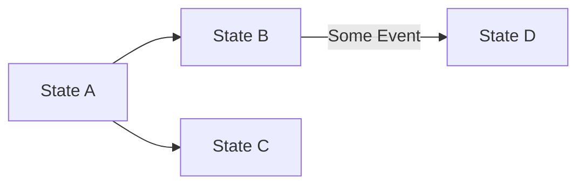

# Basic Usage

Let's use the following example:



We have the states A, B, C, and D, and their possible transitions.

## Creating States

First, we create the states:

```php
$stA = new State("A");
$stB = new State("B");
$stC = new State("C");
$stD = new State("D");
```

## Defining Transitions

Then, we define the transitions. Each transition can optionally have a **condition** that implements the `TransitionConditionInterface`. The condition's `canTransition()` method receives the `data` array and returns `true` or `false` to allow or deny the transition.

```php
use ByJG\StateMachine\TransitionConditionInterface;

// Simple transitions without conditions
$transitionA_B = new Transition($stA, $stB);
$transitionA_C = new Transition($stA, $stC);

// Transition with a condition
$condition = new class implements TransitionConditionInterface {
    public function canTransition(?array $data): bool {
        return !is_null($data);
    }
};
$transitionB_D = new Transition($stB, $stD, $condition);
```

:::info
The `TransitionConditionInterface` validates whether the transition can occur. This is different from `StateActionInterface` which executes actions when `$state->process()` is called.
:::

## Creating the State Machine

After creating the states and the transition, we can create the State Machine:

```php
$stateMachine = FiniteStateMachine::createMachine()
    ->addTransition($transitionA_B)
    ->addTransition($transitionA_C)
    ->addTransition($transitionB_D);
```

## Validating Transitions

We can validate the transition using the method `canTransition($from, $to)`. Some examples:

```php
$stateMachine->canTransition($stA, $stB);  // returns true
$stateMachine->canTransition($stA, $stC);  // returns true
$stateMachine->canTransition($stA, $stD);  // returns false
$stateMachine->canTransition($stB, $stA);  // returns false
$stateMachine->canTransition($stB, $stD);  // returns false
$stateMachine->canTransition($stB, $stD, ["some_info"]); // returns true
$stateMachine->canTransition($stC, $stD); //returns false
```

## Checking Initial and Final States

We can also check if a state is initial or final:

```php
$stateMachine->isInitialState($stA); // returns true
$stateMachine->isInitialState($stB); // returns false
$stateMachine->isFinalState($stA); // returns false
$stateMachine->isFinalState($stC); // returns true
$stateMachine->isFinalState($stD); // returns true
```

## Alternative Ways to Create the State Machine

Alternatively, you can create the state machine using the `createMachine` factory method with arguments as follows:

```php
$condition = new class implements TransitionConditionInterface {
    public function canTransition(?array $data): bool {
        return !is_null($data);
    }
};

$stateMachine = FiniteStateMachine::createMachine(
    [
        ['A', 'B'],
        ['A', 'C'],
        ['B', 'D', $condition]
    ]
);
```
