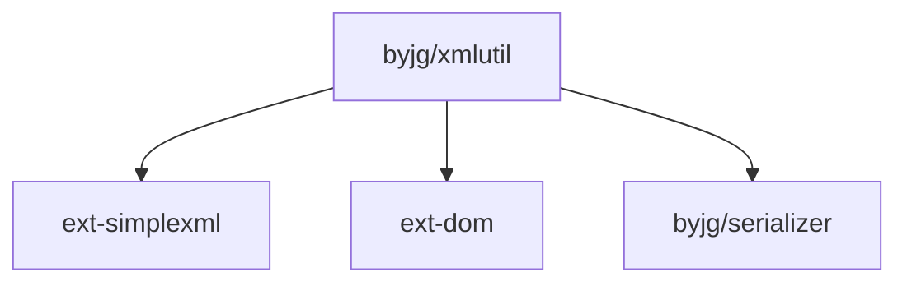

# XML Utility

A powerful and intuitive PHP library for working with XML documents. This utility makes XML manipulation, querying,
and conversion simple and straightforward in PHP.

[](https://github.com/sponsors/byjg)
[](https://github.com/byjg/php-xmlutil/actions/workflows/phpunit.yml)
[](http://opensource.byjg.com)
[](https://github.com/byjg/php-xmlutil/)
[](https://opensource.byjg.com/opensource/licensing.html)
[](https://github.com/byjg/php-xmlutil/releases/)

## Overview

PHP XML Util provides a comprehensive set of tools for XML manipulation in PHP applications. It simplifies common 
XML operations with an intuitive API, allowing developers to create, modify, query, and validate XML documents
with minimal code.

The library is designed to be lightweight yet powerful, offering features that go beyond 
PHP's built-in XML functionality while maintaining a clean and easy-to-use interface.

## Key Features

- **Simple XML Creation API** - Create and manipulate XML documents programmatically with an intuitive API
- **XPath Querying** - Easily query and navigate XML documents using XPath expressions
- **PHP Model ↔ XML Conversion** - Seamlessly convert between PHP objects and XML representations
- **Attribute-Based Mapping** - Use PHP attributes to control XML serialization behavior
- **Namespace Support** - Full support for XML namespaces in all operations
- **Document Cleaning** - Selectively remove specific tags from XML documents
- **XML Validation** - Validate XML documents against schemas
- **File Handling** - Convenient methods for loading and saving XML from/to files

## Quick Example

```php
<?php
use ByJG\XmlUtil\XmlDocument;

// Create a new XML document
$xml = new XmlDocument('<root />');

// Build the document structure
$myNode = $xml->appendChild('mynode');
$myNode->appendChild('subnode', 'text');
$myNode->appendChild('subnode', 'more text');
$otherNode = $myNode->appendChild('othersubnode', 'other text');
$otherNode->addAttribute('attr', 'value');

// Output formatted XML
echo $xml->toString(format: true);
```

Output:
```xml
<?xml version="1.0" encoding="utf-8"?>
<root>
  <mynode>
    <subnode>text</subnode>
    <subnode>more text</subnode>
    <othersubnode attr="value">other text</othersubnode>
  </mynode>
</root>
```

## Documentation

The library is fully documented with detailed guides and examples for each feature:

- [Creating XML Documents](using-api): Learn how to create and manipulate XML documents using the API
- [Working with Namespaces](namespaces): Guide to handling XML namespaces properly
- [Querying with XPath](query-document): How to use XPath expressions to query XML documents
- [PHP Models to XML](convert-model-xml): Converting PHP objects to XML and vice versa
- [Attribute-Based Mapping](convert-model-xml-withattributes): Using PHP attributes to control XML serialization
- [Cleaning Documents](clean-document): Removing specific tags from XML documents
- [File Operations](file-handling): Loading and saving XML from/to files
- [XML Validation](validate-document): Validating XML documents against schemas

## Installation

```bash
composer require "byjg/xmlutil"
```

## Running Tests

```bash
vendor/bin/phpunit
```

## License

MIT

## Dependencies



----
[Open source ByJG](http://opensource.byjg.com)