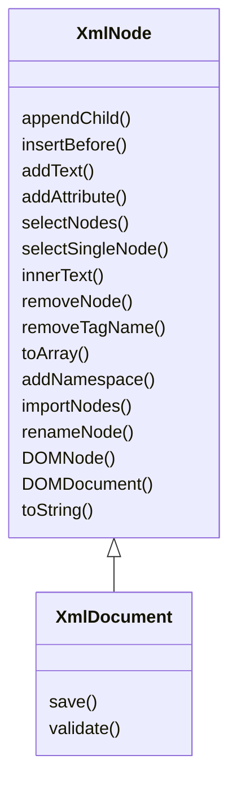

# Using the API

The XmlUtil library provides a simple but powerful API for working with XML documents. Here's how to get started.

## Creating XML Documents

### From a string

```php title="Creating from an XML string"
<?php
use ByJG\XmlUtil\XmlDocument;

// Create from an XML string
$xml = new XmlDocument('<root />');
```

### From a file

```php title="Creating from a file"
<?php
use ByJG\XmlUtil\XmlDocument;
use ByJG\XmlUtil\File;

// Create from a file
$file = new File('/path/to/file.xml');
$xml = new XmlDocument($file);
```

### Create an empty document

```php title="Creating an empty document"
<?php
use ByJG\XmlUtil\XmlDocument;

// Create an empty document with a specific root element
$xml = XmlDocument::emptyDocument('root');

// Create with a namespace
$xml = XmlDocument::emptyDocument('root', 'http://www.example.com/ns');
```

## Building XML Structure

```php title="Building XML structure programmatically"
<?php
use ByJG\XmlUtil\XmlDocument;

$xml = new XmlDocument('<root />');

// Add child nodes
$myNode = $xml->appendChild('mynode');
$myNode->appendChild('subnode', 'text');
$myNode->appendChild('subnode', 'more text');
$otherNode = $myNode->appendChild('othersubnode', 'other text');

// Add attributes
$otherNode->addAttribute('attr', 'value');

// Output formatted XML
echo $xml->toString(format: true);
```

Output:

```xml title="Resulting XML"
<?xml version="1.0" encoding="utf-8"?>
<root>
  <mynode>
    <subnode>text</subnode>
    <subnode>more text</subnode>
    <othersubnode attr="value">other text</othersubnode>
  </mynode>
</root>
```

## Working with Nodes

### Adding Text

```php title="Adding text and CDATA"
$node = $xml->appendChild('node');
$node->addText('Some text');

// Add CDATA section
$node->addText('This is <CDATA> content', true);
```

### Inserting Nodes

```php title="Inserting nodes before the current node"
// Insert a node before the current node
$newNode = $node->insertBefore('newnode', 'new node text');
```

### Getting the Parent Node

```php title="Getting the parent node"
$parent = $node->parentNode();
```

### Renaming Nodes

```php title="Renaming nodes"
// Rename the current node
$node->renameNode('newName');

// Rename with namespace prefix
$node->renameNode('prefix:newName');
```

### Removing Nodes

```php title="Removing nodes"
// Remove the current node
$node->removeNode();

// Remove all nodes with a specific tag name
$xml->removeTagName('tagToRemove');
```

### Adding objects

```php title="Adding PHP objects to XML"
// Add a PHP object or array to the XML structure
$object = new stdClass();
$object->property = 'value';
$node->appendObject($object);
```

### Importing nodes from another document

```php title="Importing nodes from another document"
// Import nodes from another document or file
$node->importNodes($otherXmlNode, 'nodeToImport');
```

## Converting to Other Formats

### Convert to Array

```php title="Converting XML to array"
$array = $xml->toArray();
```

### Convert to String

```php title="Converting XML to string"
// Default output
$string = $xml->toString();

// Formatted output
$string = $xml->toString(format: true);

// Without XML header
$string = $xml->toString(noHeader: true);
```

## Accessing DOM Objects

```php title="Accessing underlying DOM objects"
// Get the underlying DOMNode
$domNode = $xml->DOMNode();

// Get the underlying DOMDocument
$domDocument = $xml->DOMDocument();
```

## Saving XML

```php title="Saving XML to file"
// Save to a file
$xml->save('/path/to/output.xml');

// Save with formatting
$xml->save('/path/to/output.xml', format: true);

// Save without XML header
$xml->save('/path/to/output.xml', format: true, noHeader: true);
```

## Class Diagram


