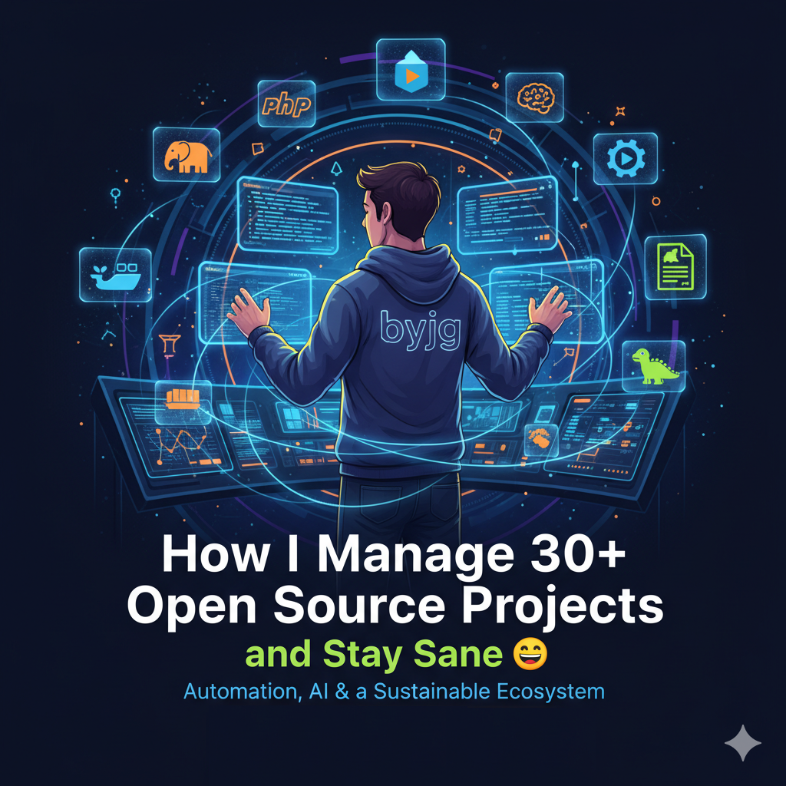

# Como eu Consigo Manter Mais de 30 Projetos Open Source (e Continuar Sano 😄)



Manter mais de **30 projetos open source** é quase como tocar uma orquestra sozinho. Cada projeto tem suas particularidades, dependências, pipelines, documentações e testes — e, ainda assim, todos precisam funcionar em harmonia.  
Em uma empresa com 30 microserviços, é comum ter algo como **2 a 4 DevOps**, **3 a 5 Product Owners** e **50 a 100 desenvolvedores**.  
Eu faço isso praticamente **sozinho**.  

Parece impossível? Vamos entender como esse ecossistema funciona, e como a automação, padronização e um bom uso de Inteligência Artificial tornam isso não apenas viável, mas prazeroso.  

<!-- truncate --> 

## O Que Eu Mantenho

Meu foco é em dois grandes pilares:  

- Um **ecossistema de componentes PHP** — que inclui desde micro-ORMs e serializers até integrações REST completas.  
- Um **conjunto de imagens Docker** — utilizadas tanto em desenvolvimento quanto em produção, que garantem consistência e reprodutibilidade em qualquer ambiente.  

Esses projetos se interconectam, formando uma arquitetura modular e reutilizável. Assim, qualquer componente pode ser usado de forma independente em outros frameworks, mas também todos podem trabalhar juntos dentro do meu ecossistema principal.  

---

## Criando um Ambiente de Developer Experience

O primeiro passo foi resolver o que mais me atrapalhava: o **setup** de desenvolvimento.  
Cada nova máquina exigia configurar dezenas de dependências — PHP, extensões, Composer, ferramentas de teste, etc. Sempre faltava alguma coisa.

A solução foi criar **imagens Docker padronizadas**.  
Hoje eu mantenho imagens PHP para diferentes usos:  

- CLI  
- FPM  
- FPM com Nginx  
- Exemplos prontos com Docker Compose  

Essas imagens são utilizadas em **ambientes de desenvolvimento, CI/CD e produção**, o que elimina variações e “works on my machine”.

Mas o desafio maior era lidar com **várias versões do PHP** em uma mesma máquina. Como já usava Docker, decidi: o ambiente de desenvolvimento **também rodaria em containers**.  
Padronizei tudo em Linux e fui testando ferramentas até criar o projeto [shellscript.download](https://shellscript.download).

Hoje, para preparar meu ambiente, basta rodar:

```bash
load.sh php-docker -- 8.4
```

E tudo está pronto — do PHP ao Composer e extensões, em minutos.

---

## Automação e Padronização de Processos

Ter 30 projetos é como ter 30 microserviços: cada um com sua documentação, arquitetura, dependências e ciclo de vida.  
A chave é **automação**.

Desde 2013, venho aperfeiçoando cada projeto individualmente, mantendo **testes automatizados**, cobertura de código significativa e integração contínua.  

Mas havia um problema: a **documentação**.  
Manter docs espalhadas entre repositórios é um pesadelo. Precisava centralizar tudo **sem duplicar trabalho**.

### A Solução

Criei um pipeline que, ao dar merge em um PR, **copia automaticamente a documentação do projeto** para um repositório central — o `byjg.github.io`.  
Esse repositório organiza o conteúdo dentro da estrutura do **[Docusaurus](https://docusaurus.io)** e dispara um build automático no **Cloudflare Pages**, publicando tudo em [https://opensource.byjg.com](https://opensource.byjg.com).

Assim, **cada commit documentado já atualiza o site principal automaticamente** — sem manutenção manual e sem custo adicional.

No final, foquei em três princípios:

1. **Automatizar o que é repetitivo**  
2. **Centralizar o que é compartilhado**  
3. **Isolar o que é independente**

---

## Criando um Ecossistema Sustentável

Meus componentes PHP seguem rigorosamente os padrões **PSR**, usam **Composer** para versionamento e podem ser integrados em qualquer framework.  
Cada projeto possui exemplos, testes e instruções de uso.  

Com o tempo, percebi que a soma desses componentes formava uma base sólida para algo maior.  
Assim nasceu o **[PHP Rest Reference Architecture](https://github.com/byjg/php-rest-reference-architecture)** — um projeto que combina os principais componentes do ecossistema em uma estrutura pronta para uso:

- CI/CD configurado  
- Suporte completo a OpenAPI  
- Autenticação e autorização integradas  
- Migração de banco de dados  
- Injeção de dependência  
- Docker e scripts de build  

Com um único comando, posso criar um projeto PHP REST funcional em minutos:

```bash
load.sh php-rest-api -- <folder> --namespace=<name> --name=<name/name> --install-examples=n
```

Essa automação permite que qualquer pessoa crie uma API completa com base em boas práticas e arquitetura limpa — sem reinventar a roda.

---

## Preparando para Produção

As **imagens Docker** que uso em desenvolvimento são as mesmas usadas em CI/CD e produção.  
Elas são publicadas no **Container Registry**, o que me permite promover versões entre ambientes (`dev → staging → production`) com total rastreabilidade.

Para o balanceamento de carga, criei o projeto **[Easy HAProxy](https://github.com/byjg/easyhaproxy)** — uma versão simplificada e poderosa do HAProxy que **se auto-configura com base nos labels Docker**.

Ele suporta SSL, evita downtime, e elimina a necessidade de editar manualmente arquivos de configuração.  
Basta subir o container e deixar ele cuidar do resto.

---

## Inteligência Artificial: O Meu Novo “Estagiário”

A IA tem sido minha aliada em várias frentes — e, honestamente, um verdadeiro *game changer*.

### Documentação
Criei prompts personalizados que cobrem 95% das minhas necessidades: desde gerar guias consistentes até evitar erros de formatação que quebram o Docusaurus.

### Design e Frontend
Meu foco sempre foi backend, e antes a criação de interfaces era lenta.  
Hoje descrevo o que quero, e a IA gera a base da interface — me permitindo focar em lógica e integração.

### Desenvolvimento Assistido
Uso o **Claude Code** como meu principal assistente técnico, o **ChatGPT** como segunda opinião, e o **Junie (PHPStorm)** para refino de código.  
Nunca deixo a IA agir totalmente sozinha — eu a trato como um *pair programmer* júnior: reviso, oriento e ajusto o caminho.  
Peço planos, discuto soluções e tomo as decisões finais.  

Isso multiplicou minha produtividade sem comprometer a qualidade.

---

## O Que Está Por Trás de Tudo Isso

### Infraestrutura
- Imagens Docker otimizadas  
- Balanceamento de carga com Easy HAProxy  
- Imagem Builder para CI/CD  

### Automação
- Pipelines CI/CD padronizados  
- Reaproveitamento de workflows entre projetos  
- Ansible e Terraform para provisionamento  
- Scripts Python para gerenciamento do GitHub  

---

## Conclusão

Manter dezenas de projetos open source **não é uma questão de tempo, é uma questão de sistema**.  
Quando cada parte do processo é automatizada, documentada e integrada, o trabalho escala naturalmente.

O segredo está em **criar um ecossistema coeso**, onde cada componente se apoia no outro — e onde o desenvolvedor se torna não apenas o autor, mas o orquestrador de um ambiente autossustentável.

No final do dia, eu foco em **um projeto por vez**, faço o melhor possível, e deixo que **a automação e a padronização cuidem do resto**.  
E é assim que, quase sozinho, mantenho 30+ projetos vivos, documentados e evoluindo continuamente.  

---

Quer ver tudo isso em ação?  
👉 Explore em [https://opensource.byjg.com](https://opensource.byjg.com)
