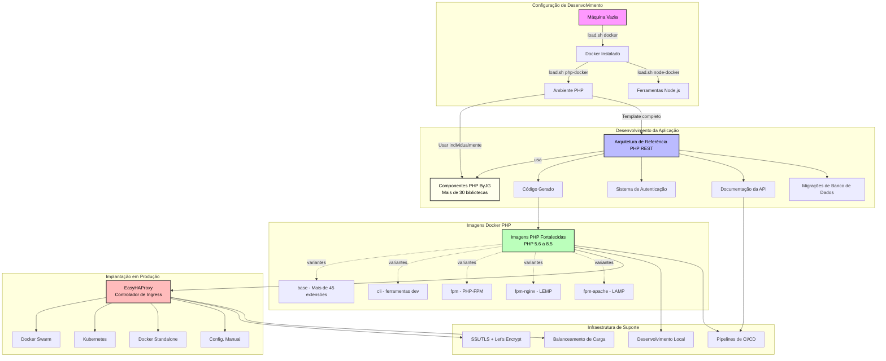

# Construindo uma Aplicação PHP Completa: Do Zero à Produção

Você já se perguntou como ir de uma máquina completamente vazia para uma aplicação PHP totalmente funcional e pronta para produção? Talvez você tenha herdado um VPS vazio, ou sua equipe queira criar um novo serviço sem gastar semanas montando ferramentas. Neste artigo, vou guiá-lo através de todo o ecossistema PHP ByJG—um conjunto abrangente de ferramentas e componentes que trabalham juntos perfeitamente para ajudá-lo a construir aplicações PHP modernas com confiança.

Seja você trabalhando com Laravel, Symfony, ou construindo do zero, esses componentes podem ajudá-lo a acelerar o desenvolvimento mantendo qualidade de nível de produção. Pense nisso como uma equipe de pit curada: cada utilitário é leve por si só, mas projetado para se encaixar quando você precisa de todo o pipeline.

### O Que Vamos Cobrir

- Configurar uma estação de trabalho em uma máquina Linux vazia (ou WSL) em minutos
- Entender o catálogo de componentes PHP e quando usar cada peça
- Usar a Arquitetura de Referência PHP REST para criar uma API
- Selecionar imagens Docker fortalecidas para cargas de trabalho de produção
- Operar um fluxo de trabalho realista do dia zero à manutenção contínua

<!-- truncate -->

## A Jornada: De uma Máquina Vazia à Produção

Vamos começar do início - uma máquina sem nada instalado - e trabalhar até uma aplicação API completa e pronta para produção.

### Passo 1: Configurando seu Ambiente de Desenvolvimento

Quando você tem uma máquina Linux vazia (ou WSL no Windows), o primeiro desafio é instalar o Docker e PHP sem gastar uma tarde copiando trechos de posts de blog. É aqui que entra o [shellscript.download](https://shellscript.download). É um único script de carregamento que fornece instaladores opinativos para que sua equipe possa padronizar toda a stack com comandos de uma linha.

**Primeiro, instale o script de carregamento (idempotente e seguro para executar novamente):**
```bash
/bin/bash -c "$(curl -fsSL https://shellscript.download/install/loader)"
```

Com o `load.sh` instalado, você pode instalar ferramentas em etapas separadas. Cada comando verifica pré-requisitos, fixa versões conhecidas e estáveis, e configura serviços da mesma forma em cada servidor.

**Instalando o Docker:**
```bash
load.sh docker
```

**Instalando o PHP 8.4 via Docker:**
```bash
load.sh php-docker -- 8.4
```

**Instalando o Node.js 22 (para ferramentas modernas de desenvolvimento como Claude Code, Codex, etc.):**
```bash
load.sh node-docker -- 22
```

É isso! Em apenas três comandos, você agora tem:
- Docker instalado e executando
- PHP 8.4 pronto para usar via containers Docker
- Node.js 22 para ferramentas modernas de desenvolvimento

A beleza desta abordagem é que tudo roda em containers—sem conflitos de versão, sem inferno de dependências, apenas ambientes limpos e reproduzíveis. Se alguém da sua equipe precisar reconstruir sua estação de trabalho ou se você mudar entre laptops, você está a poucos comandos de ter paridade.

## O Ecossistema de Componentes PHP

Uma vez que seu ambiente está pronto, você ganha acesso a uma extensa coleção de [componentes PHP testados em produção](https://opensource.byjg.com/docs/php) que podem ser usados com **QUALQUER framework PHP**—Laravel, Symfony, Slim, ou sua própria solução customizada. Esses pacotes surgiram de projetos reais de clientes, então cada um resolve um problema operacional específico: configuração, cache, persistência, mensageria, e mais.

Abaixo está um tour guiado agrupado por camada. Use-o como um menu; você pode pegar apenas o que precisa, ou montar a stack completa ao criar um novo serviço.

### Componentes de Infraestrutura Essenciais

Comece com os blocos de construção que mantêm configuração, cache e migrações previsíveis em todos os ambientes.

**[Cache Engine](https://opensource.byjg.com/docs/php/cache-engine)** - Cache compatível com PSR-6 e PSR-16 com múltiplos backends:
- Sistema de arquivos, Redis, Memcached, Session
- Memória compartilhada (ShmOp), TmpFS
- Coleta de lixo integrada e operações atômicas

**[Config Management](https://opensource.byjg.com/docs/php/config)** - Configuração baseada em ambiente com suporte a injeção de dependência

**[Migration](https://opensource.byjg.com/docs/php/migration)** - Controle de versão de banco de dados com migrações up/down suportando MySQL, PostgreSQL, SQLite, Oracle e SQL Server

### Acesso a Dados & ORM

Em seguida, configure a persistência de dados. A camada AnyDataset oferece acesso unificado a múltiplos bancos de dados, e o Micro-ORM adiciona estrutura suficiente sem prendê-lo em um framework pesado.

**[Micro-ORM](https://opensource.byjg.com/docs/php/micro-orm)** - Mapeamento Objeto-Relacional leve com:
- Query builder
- Suporte ao padrão Active Record
- Suporte ao padrão Repository
- Mapeamento de relacionamentos sem sobrecarga pesada

**[AnyDataset-DB](https://opensource.byjg.com/docs/php/anydataset-db)** - Camada de abstração de banco de dados universal suportando múltiplos bancos de dados com uma API consistente

### API REST & Web Services

Com os dados cobertos, exponha-os através de APIs que seguem os contratos que você publica.

**[RestServer](https://opensource.byjg.com/docs/php/restserver)** - Crie serviços RESTful com:
- Auto-geração a partir de definições OpenAPI/Swagger
- Múltiplos manipuladores de saída (JSON, XML, HTML)
- Suporte integrado a middleware (CORS, JWT, Static Server)
- Cache de rotas para performance

**[Swagger Test](https://opensource.byjg.com/docs/php/swagger-test)** - Testes de contrato para garantir que sua API corresponda à sua especificação OpenAPI

### Segurança & Autenticação

A autenticação está integrada ao invés de apenas acoplada, para que você possa construir funcionalidades sem reinventar armazenamento de sessão ou fluxos JWT.

**[AuthUser](https://opensource.byjg.com/docs/php/authuser)** - Sistema completo de autenticação e autorização de usuários com:
- Gerenciamento de sessões
- Propriedades customizadas
- Múltiplos backends de armazenamento (Database, XML)

**[JWT Wrapper](https://opensource.byjg.com/docs/php/jwt-wrapper)** - Manipulação de JSON Web Token para autenticação stateless

**[JWT Session](https://opensource.byjg.com/docs/php/jwt-session)** - Gerenciamento de sessão baseado em JWT

**[Crypto](https://opensource.byjg.com/docs/php/crypto)** - Criptografia simétrica sem senha com geração dinâmica de chaves

### Comunicação

Aplicações modernas raramente operam isoladamente. Esses clientes mantêm a comunicação externa (mail, filas, SMS) consistente.

**[MailWrapper](https://opensource.byjg.com/docs/php/mailwrapper)** - Envie e-mails através de múltiplos provedores:
- SMTP (SSL/TLS)
- Amazon SES API
- Mailgun API
- Sendmail

**[Message Queue Client](https://opensource.byjg.com/docs/php/message-queue-client)** - Interface unificada para filas de mensagens:
- Suporte a RabbitMQ via [rabbitmq-client](https://github.com/byjg/rabbitmq-client)
- Suporte a Redis Queue via [redis-queue-client](https://github.com/byjg/redis-queue-client)
- Fácil de implementar conectores customizados

**[SMS Client](https://opensource.byjg.com/docs/php/sms-client)** - Envie SMS através de vários provedores

### Utilitários

Finalmente, um conjunto de ajudantes focados para tarefas do dia a dia—geração de IDs, manipulação de imagens, conversão e manipulação de URI.

**[ShortId](https://opensource.byjg.com/docs/php/shortid)** - Gere IDs curtos, únicos e seguros para URL

**[ImageUtil](https://opensource.byjg.com/docs/php/imageutil)** - Manipulação e processamento de imagens

**[Convert](https://opensource.byjg.com/docs/php/convert)** - Utilitários de conversão de dados

**[URI](https://opensource.byjg.com/docs/php/uri)** - Manipulação e análise de URI

E [muitos mais componentes](https://opensource.byjg.com/docs/php) cobrindo várias necessidades...

### Principais Vantagens

- **Agnóstico de Framework**: Use qualquer componente independentemente em seus projetos existentes
- **Compatível com PSR**: Segue os padrões PHP-FIG (PSR-6, PSR-7, PSR-11, PSR-16)
- **Bem Documentado**: Cada componente tem documentação abrangente com exemplos
- **Testado em Produção**: Usado em ambientes de produção reais
- **Pronto para Composer**: Instalação simples via `composer require byjg/component-name`

## Construindo uma Aplicação Completa do Zero

Embora você possa usar componentes individuais com qualquer framework, e se você quiser criar uma aplicação API completa do zero e manter alta velocidade? É aqui que entra a **[Arquitetura de Referência PHP REST](https://github.com/byjg/php-rest-reference-architecture)**. Intencionalmente não é outro framework—é um conjunto de opiniões capturadas como código para que você possa fazer fork, adaptá-lo e ainda reconhecer cada parte móvel.

### O Que é a Arquitetura de Referência PHP REST?

A Arquitetura de Referência PHP REST é um **template pronto para produção** (não um framework) que reúne os melhores componentes do ecossistema ByJG em uma estrutura de aplicação coesa e pronta para uso.

### O Que Está Incluído

O template é dividido em camadas para que você possa continuar ajustando ou afrouxando abstrações dependendo do estágio do seu produto.

**Geração de Código & Arquitetura:**
- Geração automática de CRUD a partir de tabelas do banco de dados
- Escolha entre Padrão Repository (separação limpa) ou Padrão ActiveRecord (prototipagem rápida)
- Modelos, repositórios, serviços, controllers e testes auto-gerados

**Segurança Integrada:**
- Sistema de autenticação baseado em JWT
- Controle de Acesso Baseado em Funções (RBAC)
- Endpoints de login prontos para uso

**Documentação da API:**
- Documentação OpenAPI auto-gerada sincronizada com o código
- Interface Swagger UI interativa para exploração da API
- Testes de contrato para manter os docs sincronizados

**Gerenciamento de Banco de Dados:**
- Sistema de migração integrado
- MicroORM para acesso leve a dados
- Query builder e mapeamento de relacionamentos

**Experiência de Desenvolvimento:**
- Containerização Docker (MySQL, PHP-FPM, Nginx)
- Scriptify: terminal PHP interativo e executor de CLI
- Suite abrangente de testes funcionais
- Hot reload durante o desenvolvimento

**Pronto para Produção:**
- Workflows de CI/CD pré-configurados (GitHub Actions, GitLab CI, Bitbucket Pipelines)
- Configuração baseada em ambiente
- Logging estruturado
- Tratamento e relatório de erros
- Conformidade com padrões PSR-7, PSR-11, PSR-6/16

### Começando com a Arquitetura de Referência

```bash
# Instale o template
load.sh php-rest-api -- my-api \
  --namespace=MyCompany \
  --name=mycompany/my-api \
  --install-examples=y
```

Este único comando cria uma aplicação API completa com:
- Estrutura de projeto seguindo arquitetura limpa
- Migrações de banco de dados prontas
- Sistema de autenticação configurado
- Documentação OpenAPI gerada
- Ambiente Docker configurado
- Pipelines de CI/CD prontos
- Testes configurados

Você pode começar a desenvolver imediatamente com:
```bash
cd my-api
docker-compose up -d
composer codegen -- --env=dev --table=users all --save
```

A partir daqui, você não está procurando stubs ou copiando controllers de projetos anteriores. A geração de código cria scaffolds de endpoints, migrações mantêm o banco de dados sincronizado, e o arquivo OpenAPI permanece acoplado aos handlers reais. Como tudo é compatível com PSR, você pode adicionar qualquer middleware adicional ou reutilizar pacotes familiares.

## Implantação em Produção

O sucesso local é apenas metade da história. Enviar para produção significa escolher imagens em que você pode confiar e uma estratégia de ingress que não vai acordá-lo durante picos de tráfego. O ecossistema inclui imagens Docker curadas e uma camada HAProxy auto-atualizável para que as peças operacionais sejam tão coesas quanto a experiência do desenvolvedor.

### Imagens Docker PHP Fortalecidas

Para implantação em produção, o ecossistema fornece [imagens Docker PHP curadas e fortalecidas em segurança](https://opensource.byjg.com/docs/devops/docker-php) suportando:

- **Versões PHP**: De 5.6 a 8.5 (edge)
- **Multi-Arquitetura**: AMD64 e ARM64 (Raspberry Pi, AWS Graviton)
- **Variantes de Imagem**:
  - `base` - Mínima com mais de 45 extensões PHP (~135MB)
  - `cli` - Ferramentas de desenvolvimento incluídas (~154MB)
  - `fpm` - PHP-FPM para configurações customizadas (~139MB)
  - `fpm-nginx` - Stack LEMP completa (~154MB)
  - `fpm-apache` - Stack LAMP completa (~154MB)

**Recursos de Segurança:**
- Executa como usuário não-root (`app`)
- Inclui SBOM & proveniência de build
- Releases mensais marcadas para estabilidade
- Atualizações regulares de segurança

**Exemplo:**
```bash
docker pull byjg/php:8.4-fpm-nginx-2025.11
```

### Balanceamento de Carga & Ingress

Para gerenciamento de tráfego em produção, [EasyHAProxy](https://opensource.byjg.com/docs/devops/docker-easy-haproxy) fornece configuração dinâmica do HAProxy através de descoberta de serviços. Seja você implantando em Docker Swarm, Kubernetes, ou uma única VM, os mesmos labels configuram certificados, roteamento e estatísticas, o que mantém as operações entediantes (da melhor maneira possível).

**Plataformas Suportadas:**
- Docker standalone
- Clusters Docker Swarm
- Kubernetes
- Configuração estática manual

**Recursos:**
- SSL/TLS automático com Let's Encrypt (protocolo ACME)
- Certificados SSL customizados
- Balanceamento de carga entre réplicas
- Recarregamentos de configuração sem downtime
- Suporte a modo TCP
- Painel de estatísticas integrado

**Exemplo para Docker Swarm:**
```bash
docker service create \
  --name my-api \
  --label easyhaproxy.host=api.example.com \
  --label easyhaproxy.ssl.type=letsencrypt \
  mycompany/my-api:latest
```

O EasyHAProxy detecta automaticamente o serviço, configura o HAProxy, obtém certificados SSL e começa a rotear o tráfego - nenhuma configuração manual necessária!

## O Fluxo Completo do Ecossistema

Veja como tudo se encaixa. O diagrama destaca como um único comando de carregamento se transforma em um template de aplicação, imagens Docker base e, eventualmente, ingress automatizado. Trace as setas para ver como cada peça alimenta o próximo estágio do ciclo de vida:



## Fluxo de Trabalho do Mundo Real

Vamos percorrer um cenário completo do mundo real. Imagine que você tem a tarefa de lançar uma API de comércio antes da próxima sessão de planejamento trimestral. A linha do tempo abaixo espelha como a maioria das equipes realmente se move—há uma explosão de configuração, um bloco de trabalho de funcionalidades, um sprint em automação e, finalmente, uma transferência para operações.

### Dia 1: Configuração do Projeto
```bash
# Configure o ambiente (uma vez)
/bin/bash -c "$(curl -fsSL https://shellscript.download/install/loader)"
load.sh docker
load.sh php-docker -- 8.4

# Crie um novo projeto
load.sh php-rest-api -- my-shop-api \
  --namespace=MyShop \
  --name=mycompany/shop-api

cd my-shop-api
docker-compose up -d
```

### Dia 2-10: Desenvolvimento
```bash
# Gere CRUD completo para a tabela de produtos
composer codegen -- --env=dev --table=products all --save

# Adicione notificações por e-mail usando MailWrapper
composer require byjg/mailwrapper

# Adicione processamento de fila para tarefas assíncronas
composer require byjg/redis-queue-client

# Execute os testes
composer test
```

Durante esta fase você está iterando rapidamente: adicione capacidades via Composer, apoie-se no CRUD gerado para evitar trabalho repetitivo e mantenha a confiança alta com a suite de testes integrada.

### Semana 2: Configuração de CI/CD
- Envie para GitHub
- Workflows de CI/CD já configurados (GitHub Actions)
- Testes automáticos em cada PR
- Build da imagem Docker no merge para main

Não há correria para montar workflows—o template já incluiu `.github/workflows` (e equivalentes para GitLab/Bitbucket), então habilitar CI é uma questão de conectar secrets e deixar o pipeline executar.

### Mês 1: Implantação em Produção
```bash
# Baixe a imagem pronta para produção
docker pull byjg/php:8.4-fpm-nginx-2025.11

# Construa a imagem da sua aplicação usando-a como base
docker build -t mycompany/shop-api:1.0.0 .

# Implante no Docker Swarm com EasyHAProxy
docker service create \
  --name shop-api \
  --replicas 3 \
  --label easyhaproxy.host=api.shop.com \
  --label easyhaproxy.ssl.type=letsencrypt \
  --label easyhaproxy.port=8080 \
  mycompany/shop-api:1.0.0
```

No momento em que você implanta, você já sabe qual tag de imagem Docker está mirando, e o EasyHAProxy mantém a configuração de ingress consistente. Escalar para mais réplicas ou apontar um hostname de staging para o mesmo serviço é uma mudança de label, não uma edição manual do HAProxy.

Sua API agora está:
- Executando com 3 réplicas para alta disponibilidade
- Balanceamento de carga automático
- Protegida com SSL Let's Encrypt
- Monitorada via estatísticas do HAProxy
- Pronta para escalar

## Por Que Este Ecossistema?

Depois de seguir o fluxo de trabalho vale a pena dar um passo atrás. Por que investir nesta coleção ao invés de misturar pacotes aleatórios do Packagist? Estas são as âncoras que mantêm a experiência coesa:

### 1. **Consistência Entre Ambientes**
As mesmas imagens Docker rodam em desenvolvimento, CI/CD e produção - eliminando problemas de "funciona na minha máquina".

### 2. **Desenvolvimento Rápido**
Vá da ideia para uma API funcionando em minutos, não dias. A geração de código cuida do boilerplate enquanto você foca na lógica de negócio.

### 3. **Qualidade de Nível de Produção**
Autenticação, autorização, logging, tratamento de erros e testes integrados significam que você começa com melhores práticas, não dívida técnica.

### 4. **Liberdade de Framework**
Use componentes individualmente em projetos existentes ou adote a arquitetura de referência completa para novos projetos.

### 5. **Práticas Modernas de DevOps**
Pronto para CI/CD, containerizado, com infraestrutura como código. Implante em qualquer plataforma de orquestração de containers.

### 6. **Sem Aprisionamento de Fornecedor**
É um template, não um framework. Você é dono do código. Modifique qualquer coisa que precisar.

### 7. **Documentação Abrangente**
Cada componente está documentado com exemplos em [opensource.byjg.com](https://opensource.byjg.com)

## Resumo dos Componentes do Ecossistema

Se você só puder lembrar de cinco links, faça-os serem estes:

| Componente | Propósito | Recursos Principais |
|-----------|-----------|---------------------|
| [shellscript.download](https://shellscript.download) | Configuração de Ambiente | Instalação de Docker, PHP, Node com um comando |
| [Componentes ByJG](https://opensource.byjg.com/docs/php) | Bibliotecas Reutilizáveis | Mais de 30 componentes PHP testados em produção |
| [Arquitetura de Referência PHP REST](https://github.com/byjg/php-rest-reference-architecture) | Template de Aplicação | Scaffold completo de API com auth, docs, CI/CD |
| [Imagens Docker PHP](https://opensource.byjg.com/docs/devops/docker-php) | Runtime de Container | Imagens fortalecidas, multi-arch PHP 5.6-8.5 |
| [EasyHAProxy](https://opensource.byjg.com/docs/devops/docker-easy-haproxy) | Controlador de Ingress | Balanceamento de carga auto-configurado & SSL |

## Começando

Pronto para construir sua próxima aplicação PHP com este ecossistema? Veja como começar, dependendo de onde seu projeto está atualmente:

1. **Para Projetos Existentes**: Navegue pela [biblioteca de componentes](https://opensource.byjg.com/docs/php) e adicione componentes individuais via Composer

2. **Para Novas APIs**: Use o template [Arquitetura de Referência PHP REST](https://github.com/byjg/php-rest-reference-architecture)

3. **Para Configuração de Ambiente**: Visite [shellscript.download](https://shellscript.download) para scripts de instalação

4. **Para Produção**: Confira [Imagens Docker PHP](https://opensource.byjg.com/docs/devops/docker-php) e [EasyHAProxy](https://opensource.byjg.com/docs/devops/docker-easy-haproxy)

## Conclusão

O ecossistema PHP ByJG fornece uma solução completa e coesa para desenvolvimento PHP moderno - do seu primeiro comando em uma máquina vazia até uma aplicação API escalável e pronta para produção.

Ao combinar:
- Configuração de ambiente simples
- Componentes modulares e reutilizáveis
- Templates prontos para produção
- Imagens Docker fortalecidas
- Balanceamento de carga automatizado

Você pode focar em construir funcionalidades ao invés de infraestrutura, mantendo qualidade de nível profissional ao longo de todo o ciclo de vida do desenvolvimento.

Seja você construindo um pequeno microsserviço ou uma aplicação complexa, este ecossistema tem as ferramentas que você precisa para ter sucesso.

---

**Explore o ecossistema:**
- Documentação: [https://opensource.byjg.com](https://opensource.byjg.com)
- GitHub: [https://github.com/byjg](https://github.com/byjg)
- Scripts de Configuração: [https://shellscript.download](https://shellscript.download)

Boa codificação!
