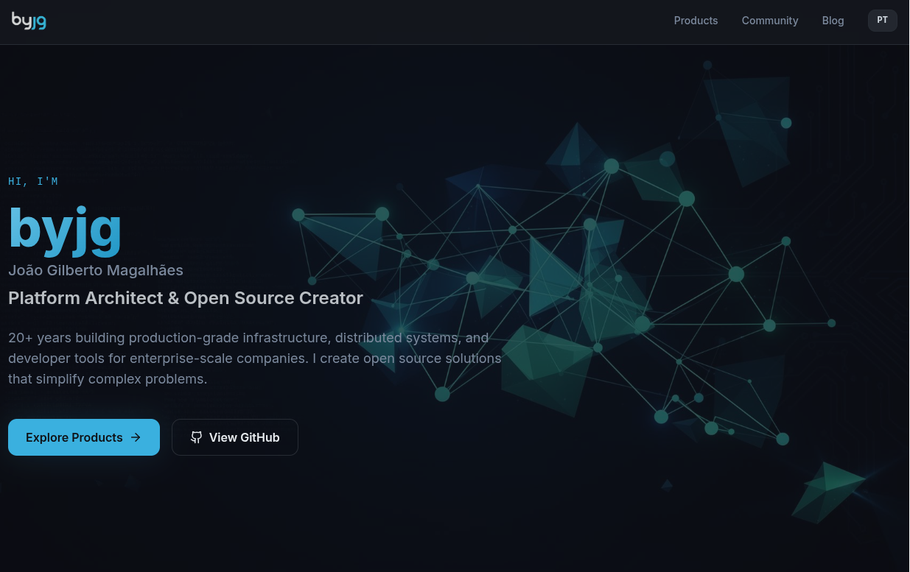
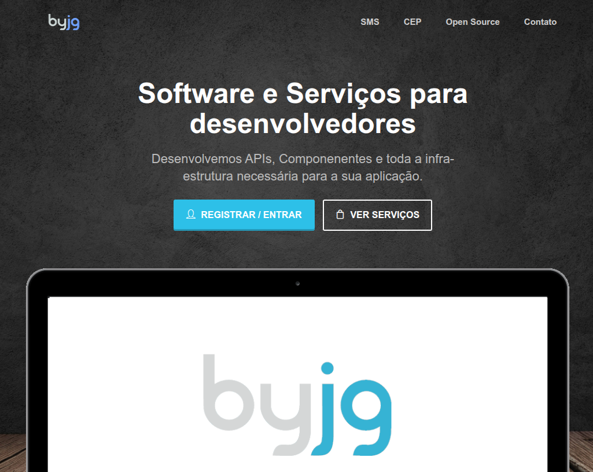
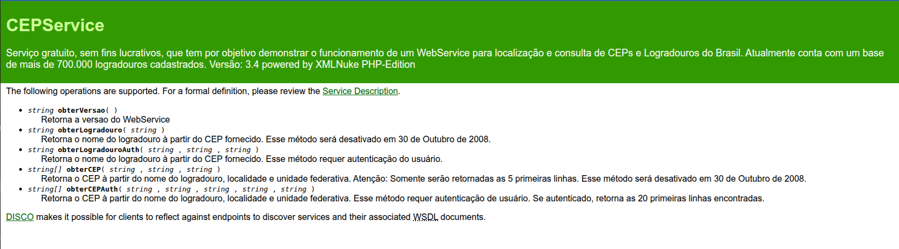
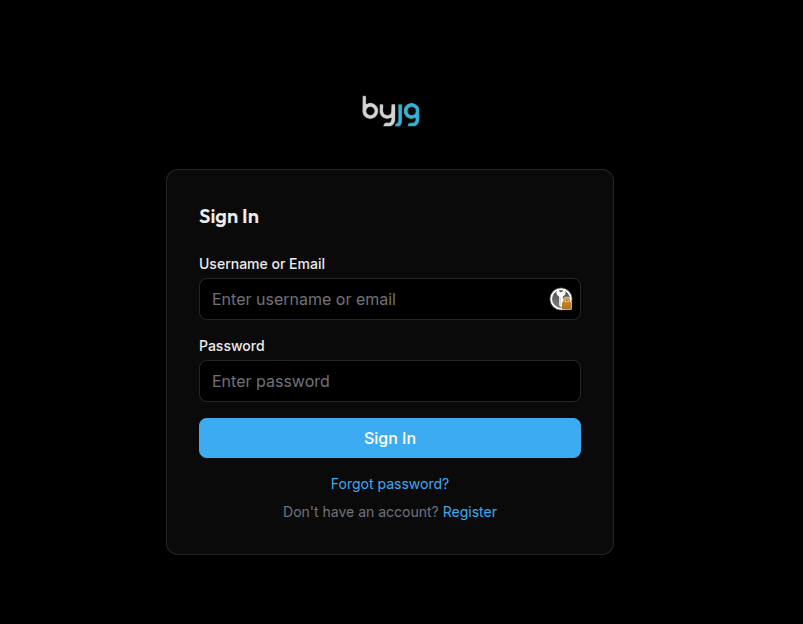
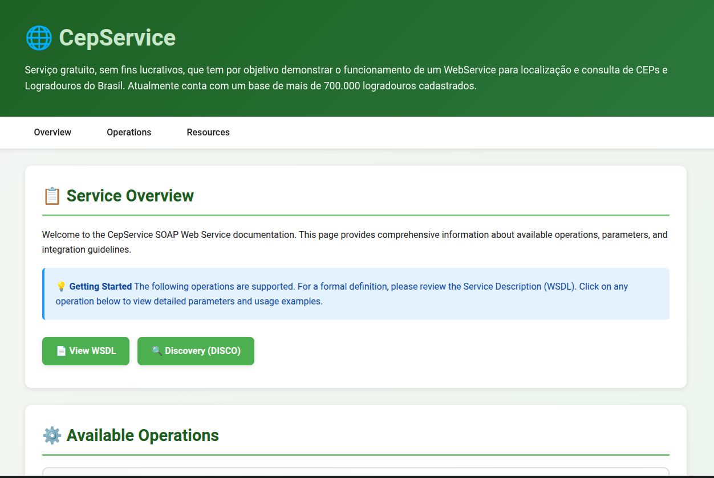

# Além do Vibe Coding — IA como Par de Programação no Desenvolvimento Real

Eu escrevo esse artigo para explicar minha jornada com o que chamam de Vibe Coding. 
Aliás, esse é um termo péssimo. Ele normalmente me remete a idéia de fazer algo seguindo uma "sensação", 
seguindo a onda dos outros — como se você não estivesse realmente no controle. No meu trabalho, 
procuro ser pragmático, e "codar na onda" não me parece algo que vai produzir resultados 
duradouros. Mas antes que você tire conclusões apressadas, deixa eu explicar alguns pontos.

<!-- truncate -->

## Produtividade com IA: o que realmente funciona

Faz algum tempo que decidi adotar assistentes de programação, e o ganho de produtividade é absurdo.
Consegui documentar minhas bibliotecas e projetos em dias, não meses. Resolvi bugs e issues muito 
mais rápido. Criei até um automatizador de prompts: tenho 50 projetos, todos precisam de 
documentação e têm o mesmo prompt — então fiz um script que entra em cada projeto, documenta, 
verifica se estou seguindo os padrões corretamente, roda os testes, o lint, conserta o que precisa.
Maravilhoso.

Mas eu sou muito exigente também. Percebi que, quando peço para a IA criar um documento sem qualquer base inicial, 
o resultado quase sempre traz frases curtas, muitos parágrafos e vários clichês do tipo 
"O problema não é... é sobre...", "Não é aquilo, é isso" — comentários de encaixe que deixam 
o conteúdo vazio. Mesmo me incomodando, para documentação técnica o COMO importa mais do que 
quantidade de texto, então deixei passar. O melhor fluxo que encontrei foi: 
eu escrevo um rascunho e uso a IA como revisora. Ela aponta erros de grafia e concordância, 
reescreve trechos que eu sei o que querem dizer, e aí eu posso opinar, questionar e melhorar.

## Pair Programming com IA, não delegação total

Aqui entra o primeiro ponto importante: eu não delego 100% para a IA. Gostaria muito. 
Mas sempre chega um ponto em que ela se perde. Repete código. Quando o teste não passa, 
ela escreve `assertTrue(true)` e anuncia feliz que agora você tem 1.000 testes funcionando. 
Vai criando monstrinhos lindos, estilo Gremlins. Quando você percebe, está consumindo recursos 
e gastando tudo o que tem.

Por isso, minha primeira regra com a IA é: Pair Programming. Eu defino a atividade, 
normalmente com uma especificação, jogo no Claude Code e peço para me dar um plano. A partir daí, 
vou ajustando esse plano até ter algo que me atenda. Quando aprovo, vou acompanhando exatamente 
o que está sendo codado, paro, intervenho, pergunto por que fez aquilo, peço para olhar a definição,
aponto para a documentação correta.

Não consigo sentar e "relaxar", mas é muito mais rápido e fico 90% satisfeito com o resultado. 
Para entender isso fora do contexto de tecnologia: se eu dou um carro para alguém que só quer 
dirigir, não importa o que eu entregue, desde que ela dirija. Mas eu não quero só dirigir — 
quero tunar o carro, fazer upgrades, integrar sistemas. E é aí que estar lado a lado ajuda muito.

Claro que há situações em que pouco importa como foi feito. Fiz sites no Lovable (vou chegar lá) 
completamente por ele — e é isso. Não preciso de mais nada. Mas no âmbito profissional, eu quero 
um produto que eu possa manter, que no final eu entenda, que possa evoluir, que seja escalável 
e confiável. Nesse momento estou fora da Vibe. Negócio real não é entregar mais por entregar — 
é entregar mais com qualidade, onde o resultado seja impecável e eu seja o DONO do processo, 
não a IA.

## O projeto real: modernizando o ByJG.com.br

Então resolvi testar na prática um cenário em que a IA não é apenas meu par de programação. 
Tenho o site ByJG.com.br, onde mantenho meu portfólio e alguns serviços — sendo que hoje só o de 
CEP WebService está ativo. Ele foi escrito por volta de 2010, saiu do deploy por `git pull` e hoje 
roda em Kubernetes com CI/CD, mas o código é o mesmo de 2010. Nele eu usava meu antigo framework 
XMLNuke, que aposentei em 2016, mas cujo código serviu de base para criar minha Arquitetura de 
Referência em PHP para Projetos REST.

Minha meta era:
- Migrar do PHP 5.6 para o 8.5
- MySQL 5.6 para o 9.0
- Evoluir o layout usando algo mais moderno como Vite ou Next
- Mudar autenticação para JWT
- Manter as APIs antigas funcionando, pois ainda tenho usuários que dependem do serviço

Parece simples, mas se eu fosse contratar um time eu precisaria de:
- Um backend capaz de trabalhar com o legado e o novo
- Um frontend que entendesse de design para fazer o site e conectar com as APIs
- Um redator para ajudar a revisar os textos

Então, atuei como Gerente de Produto técnico Hands-On e contratei o seguinte time:
- **Claude Code Max** como meu Backend (e FullStack)
- **Lovable Pro** como meu Frontend
- **Emergent.sh** como meu Frontend alternativo
- **ChatGPT Pro** como Solutions Architect, Revisor e Editor de Imagens

Paguei por todos esses serviços.

## Lovable vs Emergent.sh: o duelo de frontends

Tanto o Lovable quanto o Emergent.sh fazem design e implementam o website. Passei o mesmo prompt 
para ambos. O Emergent.sh, na fase de criação, se saiu melhor: perguntava coisas que não estavam 
bem definidas, o que gostei muito. Isso me ajudou a refinar o prompt para que fosse mais claro e 
específico, e fiz um novo projeto em ambos. A primeira versão do Emergent, em todas as tentativas,
foi excelente.

**Emergent.sh**

**Lovable**

Pontos que analisei em cada um:

| Feature                         | Emergent.sh           | Lovable             |
|---------------------------------|-----------------------|---------------------|
| Design                          | Excelente             | Bom                 |
| Código Gerado                   | Ruim (Craco)          | Excelente (Vite)    |
| Integração com o Git            | Bom                   | Muito Bom           |
| Edição de Código                | Excelente (usa Coder) | Boa (proprietário)  |
| Continuidade do Projeto         | Ruim                  | Bom                 |
| Deploy (testei apenas o Front)  | Ruim                  | Bom                 |

O código gerado pelo Emergent parece ter saído de um template à moda antiga: tem uma 
pasta `backend`, outra `frontend`, e exige aquela estrutura para funcionar. 
O backend usa Python e o frontend usa Craco — um framework abandonado, com várias dependências 
antigas e vulnerabilidades. Quando o Emergent salva o código no git (o bom é que posso enviar 
para qualquer repositório e branch), o `yarn.lock` não era incluído. Quando tentava rodar 
`yarn install`, nada era instalado por conta das dependências quebradas.

Foi aí que chamei meu backend Claude, e percebi que ele também era Full-Stack. Ele recomendou 
migrar para o Vite, explicou os motivos e executou a migração rapidamente. No Lovable, 
não consegui especificar QUAL repositório git usar, mas ele consegue manter o projeto sincronizado 
tanto se eu mexesse fora quanto dentro do Lovable — e se vira bem com qualquer framework, o que 
garante boa continuidade. O deploy do front-end no Emergent.sh custa 50 créditos; 
no Lovable é gratuito.

**Meu veredicto**: Preciso contratar um designer que faça o Figma — ainda vou procurar. 
E o Lovable implementa bem. Com o MVP do frontend mais ou menos encaminhado, passo as integrações
e o código mais pesado para meu FullStack, o Claude, e retorno ao Lovable para publicar. 
No projeto ByJG, vou publicar na Cloudflare — mas isso é outra história.

## A migração do código legado

Na segunda parte, veio a conversão do código legado para o novo. Antes de passar a missão para o 
Claude, precisei criar a infraestrutura mínima: instalei o projeto de Referência com algumas 
classes e testes, coloquei o ambiente para rodar e defini as instruções de como testar e como era 
a arquitetura. Com ambos os ambientes rodando, parti para dar as instruções ao Claude.

A instrução inicial sempre no modo de Planejamento. Em vez de pedir uma conversão total, 
identifiquei os blocos comuns e comecei a trabalhar neles. Primeiro pedi para criar o Login, 
Registro e "Esqueci minha senha". Era crítico porque definiria todo o resto. 
Quando a API estava implementada, pedi para o Claude gerar um Guia de Implementação do Login 
com fluxos e como lidar com o JWT. Esse guia usei para implementar as telas no frontend. 
Funcionou bem.

Um detalhe importante: cada atividade era uma sessão diferente do Claude. Isso o força a 
pesquisar o código, o que, pelo menos para mim, gerou resultados melhores. Depois disso, 
repeti o processo nos outros módulos do site.

Muitas vezes, quando ele sugere uma mudança que não entendi ou não achei eficiente, eu rejeito e 
começo assim: "Pergunta: por que utilizou isso e não aquilo?" ou "Você olhou a documentação na 
pasta X ou no código ABC?" Isso é uma forma de levá-lo a pesquisar mais sobre o código e sugerir 
soluções melhores. Há situações em que pesquisei no Google sobre o tema para discutir mais 
tecnicamente, especialmente quando estava em dúvida. E muitas vezes eu dava uma solução, mas 
deixava aberto para que ele pudesse sugerir alternativas.

## As situações irritantes

Tem situações bem irritantes: 99% das vezes ele sabe como subir a aplicação e testar, pois isso está nas suas instrucões, 
mas em 1% das vezes ele se perde e fica num loop tentando resolver o problema da forma errada. 
Nesse caso, eu interrompo, fecho a sessão e começo uma nova dizendo: "Investigue por que isso 
não funciona" ou "O código da linha X está com erro; o comportamento esperado é A, B, C."

Algumas vezes ele simplesmente não sabe o que fazer, inventa que completou a tarefa quando 
na verdade não completou (ainda bem que não é CLT), faz uma gambiarra para dizer que 
os testes passaram. Enfim, tem que vigiar.

## Conclusão

De qualquer forma, fiquei muito satisfeito com o resultado. E não chamo isso de Vibe Coding — 
seria injusto. Faz parecer menor do que é.

No final, transformei um site completamente desatualizado em algo assim:

### Antes

  

### Depois

  